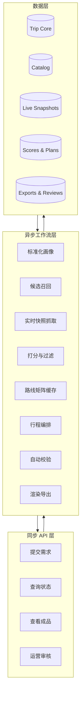

# 日本旅行 AI 后端完整方案（第一性原理评审版）

版本：v2.0  
日期：2026-03-18  
适用阶段：日本站 MVP → 单国家规模化 → 多国家复制  
定位：**旅行规划与交付引擎**，不是“一个会聊天的大模型”

---

## 0. 执行摘要

这份方案不是在原稿上做措辞优化，而是从第一性原理重构系统边界。

### 这套系统真正要解决的问题
不是“生成一份攻略”，而是：

> 在事实会变化、用户约束很多、路线组合复杂、交付要可解释的前提下，稳定地产出一份**可执行、可验证、可复盘、可售卖**的日本旅行方案。

### 从第一性原理推出的 7 条系统结论

1. **事实与表达必须分离**  
   酒店库存、票价、营业时间、闭馆、天气、签证规则，都属于事实层；推荐理由、话术、PDF 页面属于表达层。事实不能交给 LLM 决定。

2. **静态知识与动态快照必须分离**  
   景点主档、酒店主档、餐厅主档是静态层；报价、房态、时刻、闭馆、天气是动态层。两者不能存在一张表里。

3. **规划与渲染必须分离**  
   行程编排的输出应该是结构化 JSON，而不是直接生成 PDF 文案。否则无法校验、无法重跑、无法 A/B、无法复用到长图和微信版。

4. **排序核心必须可解释**  
   真正值钱的是“为什么推荐它、为什么不用别的”。排序引擎不能黑箱化，必须能拆到分项。

5. **人工经验应该做修正，不应该做事实真相**  
   你的经验非常重要，但应该以 editorial boost / editorial label 的方式干预 shortlist，而不是成为一切对象的主分来源。

6. **MVP 的复杂度主要来自工作流，不来自并发**  
   所以应采用模块化单体，而不是微服务。

7. **系统最终卖的是决策质量，不是 token 数量**  
   你未来的护城河不在“会用多少 agent”，而在“能否把事实、约束、路线、审美、经验整合成高质量结果”。

### 最终架构一句话

> **一个模块化单体 + 一个主数据库 + 一个缓存 + 一个异步任务系统 + 一个可追溯的导出流水线**。

---

## 1. 用第一性原理重新定义产品

### 1.1 用户真正购买的不是攻略，而是这 4 件事

1. **减少选择成本**：从 100 个选项收敛到 3–5 个可靠选项  
2. **降低出错概率**：避免闭馆、路线过载、酒店区选错、时段安排错  
3. **提升预算效率**：同样预算得到更好的住行体验组合  
4. **获得交付成品**：PDF / H5 / 长图 / 微信摘要 / 行中备用方案

### 1.2 由此推导出的系统目标函数

系统的目标不是“文本像人写的一样”，而是综合最大化：

```text
Utility = 可执行性 × 适配度 × 解释性 × 交付速度 × 复用能力
```

任何让系统更像聊天机器人、但降低上述任一项的设计，都不是最优设计。

### 1.3 系统最小闭环


闭环里最重要的是 **D/E/F/G**，不是最后的文案润色。

---

## 2. 我对原始方案的正式评审结论

基于你的原稿，我保留以下方向：

- 实体模块化：景点 / 酒店 / 餐饮独立建模
- 行程串联模块单独存在，不让 LLM 直接写整篇
- 模板渲染独立，支持 H5 / PDF / 长图
- 自动审核闸门前置
- 双评分体系思路可用
- 日本站 MVP 先缩到 4–7 天自由行

但我会正式调整以下设计：

### 2.1 调整一：从“多 agent 思维”改成“工作流思维”

原稿里有 agent 划分，这在展示上没问题，但工程上不应该把 agent 当系统核心。  
真正核心是**工作流节点**：标准化、召回、抓取、打分、编排、审核、渲染。

> 推荐实现：少量 LLM 能力 + 明确的状态机 + 队列任务，而不是一堆互相调用的 agent。

### 2.2 调整二：从“人工评分重权”改成“编辑修正权”

你的经验是高价值资产，但如果在 MVP 阶段就把人工评分重权放进所有对象主排序，会导致：

- 排序漂移
- 无法判断系统策略是否进步
- 后续难以训练或回放

> 推荐实现：系统先排 shortlist，人工评分只做 editorial boost / downgrade。

### 2.3 调整三：从“实时抓一切”改成“主档 + 快照”

如果把静态和动态混在一起，系统会越来越难维护。  
最优设计是：

- 主档：相对稳定
- 快照：高时效
- 计划：一次生成的派生结果

### 2.4 调整四：从“直接生成成品”改成“先结构化，再渲染”

任何不能输出结构化中间结果的系统，最终都很难做到：

- 审核
- Debug
- 再生成
- 多模板导出
- 对外解释

---

## 3. 最优系统边界

## 3.1 这套系统是什么

这是一套 **旅行决策引擎 + 交付引擎**。

它负责：

- 接需求
- 结构化画像
- 召回候选
- 补全事实
- 打分与路线装配
- 自动校验
- 输出交付物

## 3.2 这套系统不是什么

它不是：

- 纯聊天机器人
- 纯内容 CMS
- 纯 OTA 搜索页
- 纯爬虫系统
- 纯 PDF 生成器

## 3.3 MVP 的非目标

MVP 明确不做：

- 多国家同时上线
- 代订 / 支付闭环 / 复杂订单拆单
- 全自动客服成交
- 用户端可视化拖拽重排
- 无限制再生成
- 高并发开放平台

---

## 4. 总体架构（推荐最终方案）

### 4.1 架构形态

**模块化单体（Modular Monolith）**

推荐原因：

- 当前复杂度来自业务编排，不来自吞吐量
- 数据强耦合，尤其 trip / score / snapshot / export 需要强一致
- MVP 阶段更需要快迭代和可调试
- 微服务会显著增加本地开发、数据一致性、重试和版本管理成本

### 4.2 推荐技术栈

- **API 框架**：FastAPI
- **数据库**：PostgreSQL
- **向量检索**：pgvector
- **缓存/锁**：Redis
- **异步任务**：队列 worker
- **对象存储**：S3 compatible
- **导出**：HTML/CSS + WeasyPrint
- **POI / 路线**：Google Places + Routes API
- **酒店库存**：Booking Demand API
- **官方动态信息**：JNTO Safety Tips + JMA + MOFA

FastAPI 原生支持 `async/await` 和 Python type hints，适合快速构建异步 API；PostgreSQL 原生支持 `json/jsonb`；pgvector 可以把向量和业务数据放在同一数据库里；Google Places 和 Routes 都要求 field mask，适合被“按需抓取 + 成本控制”的后端工作流调用；Booking Demand API 提供 search/details/availability 等正式接口；WeasyPrint 能把 HTML/CSS 转成 PDF，适合攻略导出。  

### 4.3 总体架构图



---

## 5. 六大领域划分（比“16 个模块”更适合后端实现）

## 5.1 Trip Core（订单与行程主域）

负责：

- 用户需求提交
- 订单与产品档位
- trip_profile
- trip_version
- itinerary_plan / day / item
- regenerate 记录
- 交付状态

> 它是所有业务对象的“主索引”。

## 5.2 Catalog（静态实体主档）

负责：

- 景点主档
- 酒店主档
- 餐厅主档
- 统一标签体系
- 媒体资源
- 编辑备注
- 人工标签和推荐理由素材

原则：

- Catalog 只存“相对稳定”的事实
- 不在 Catalog 中存高频价格快照

## 5.3 Live Inventory（动态快照域）

负责：

- 酒店报价/房态 snapshot
- 航班 snapshot
- 营业时间 snapshot
- 天气/灾害 snapshot
- 签证规则 snapshot

原则：

- 每个快照必须有 `source / fetched_at / expires_at / parse_version`
- 所有时效信息都必须可追溯

## 5.4 Ranking & Planning（排序与编排域）

负责：

- 候选召回
- 硬约束过滤
- 分项评分
- 风险扣分
- 矩阵缓存
- 行程装配
- 备用方案

这是系统最核心的域。

## 5.5 Rendering（交付渲染域）

负责：

- HTML context 组装
- PDF 渲染
- H5 渲染
- 微信版摘要
- 小红书长图版摘要

## 5.6 Review & Ops（审核运营域）

负责：

- 人工编辑评分
- 审核规则
- 抽检与发布
- 失败重跑
- 模板版本
- 评分版本
- 运营指标和实验开关

---

## 6. 数据分层：这是整套系统最重要的设计

### 6.1 Layer A：主档事实（Catalog）

这层存不常变的东西：

- 地点 ID
- 名称
- 坐标
- 区域
- 类型
- 标签
- 建议停留时长
- 常规说明
- 常规媒体

### 6.2 Layer B：动态快照（Live Snapshots）

这层存高时效信息：

- 酒店报价/库存
- 航班报价/时刻
- 餐厅营业变化
- 景点临时关闭
- 天气/地震/预警
- 签证/入境相关动态

### 6.3 Layer C：派生结果（Scores / Plans / Exports）

这层存系统计算出来的东西：

- entity_score
- candidate_set
- route_matrix_cache
- itinerary_plan
- export_asset

### 6.4 为什么必须三层分离

因为：

- 主档更新频率低，适合人工修正
- 快照更新频率高，适合按需抓取和 TTL
- 派生结果必须绑定当时使用的快照版本

否则你永远无法回答：

> “为什么昨天推荐这家酒店，今天不推荐了？”

---

## 7. LLM 的正确位置

### 7.1 LLM 适合做的事

- 自然语言需求转结构化字段
- 归一化同义表达
- 推荐理由生成
- 文案风格化
- 审核摘要
- 输出不同模板口吻

### 7.2 LLM 不适合做的事

- 决定营业时间
- 决定库存是否存在
- 决定酒店是否可订
- 决定最终事实字段
- 主导排序核心分
- 直接写最终 itinerary 事实数据

### 7.3 一个非常关键的原则

> **LLM 只能参与“解释层”和“组织层”，不能成为“事实层”和“执行层”的真相源。**

这条原则一旦破坏，系统后面几乎一定会失控。

---

## 8. 需求采集与标准化设计

## 8.1 为什么标准化是核心，而不是聊天

因为用户真正输入的不是规范字段，而是：

- “第一次去东京，带对象，不想太赶”
- “爸妈腿脚一般，想住好一点”
- “预算 1.5w 左右，想吃好一点，别太折腾”

系统的第一步必须把它们变成稳定的结构。

## 8.2 推荐标准化输出

```json
{
  "trip_type": "free_independent_travel",
  "country": "JP",
  "origin_city": "Shanghai",
  "travel_month": "2026-05",
  "days": 6,
  "party_type": "couple",
  "party_size": 2,
  "budget_band": "mid_high",
  "pace": "balanced",
  "trip_experience": "first_time",
  "must_have_tags": ["good_food", "photo_friendly", "comfortable_transit"],
  "avoid_tags": ["too_early_departure", "overpacked_days"],
  "flight_preferences": {
    "depart_after": "09:00",
    "arrive_before": "20:00",
    "direct_flight_preferred": true
  },
  "theme_weights": {
    "shopping": 0.15,
    "food": 0.25,
    "culture": 0.15,
    "photo_spots": 0.20,
    "onsen": 0.10,
    "comfort": 0.15
  }
}
```

## 8.3 关键字段

至少要有：

- 出发城市
- 时间窗口
- 天数
- 人数
- 同行关系
- 第几次去日本
- 预算带
- 节奏
- 起飞/落地偏好
- must_have
- avoid
- theme_weights

---

## 9. 实体建模（POI / Hotel / Restaurant）

## 9.1 统一基类 `entity_base`

建议先统一实体公共字段：

| 字段 | 含义 |
|---|---|
| entity_id | 内部统一主键 |
| entity_type | poi / hotel / restaurant |
| source | google_places / booking / internal |
| source_id | 外部主键 |
| name_local | 本地名 |
| name_zh | 中文名 |
| city | 城市 |
| area | 区域 |
| lat/lng | 坐标 |
| tags | 标准化标签 |
| media_assets | 图片/封面 |
| status | active / deprecated |
| updated_at | 最近主档更新时间 |

### 9.2 POI 主档建议字段

额外字段：

- categories
- opening_hours_summary
- typical_visit_duration
- best_time_slot
- weather_sensitivity
- queue_risk
- ticket_level
- rain_backup_candidates

### 9.3 Hotel 主档建议字段

额外字段：

- star_level
- category
- transport_score
- family_friendly_score
- pet_friendly_score
- room_size_hint
- checkin_notes
- neighborhood_profile

### 9.4 Restaurant 主档建议字段

额外字段：

- cuisine
- price_range
- meal_slots
- accepts_reservations
- queue_risk
- signature_items
- suitable_for

---

## 10. 动态快照设计（一定不要和主档混）

## 10.1 酒店快照

建议拆成：

- `hotel_offer_snapshot`
- `hotel_offer_line`

### 头表字段

- snapshot_id
- trip_id
- source
- currency
- checkin_date
- checkout_date
- occupancy
- fetched_at
- expires_at
- request_hash

### 行表字段

- offer_line_id
- snapshot_id
- hotel_id
- room_type
- breakfast_included
- cancellation_policy
- total_price
- availability
- taxes_included
- score_inputs

## 10.2 航班快照

- snapshot_id
- origin
- destination
- depart_date_range
- return_date_range
- passenger_mix
- fetched_at
- expires_at
- offer_list_jsonb

## 10.3 营业时间 / 天气 / 签证快照

统一放 `source_snapshots`：

- source_name
- source_object_type
- source_object_id
- raw_payload
- normalized_payload
- fetched_at
- expires_at
- parse_version

---

## 11. 检索与召回设计

## 11.1 第一性原理：不要让 LLM 从全世界里“想”答案

规划系统必须先有候选集，然后再做排序。  
所以召回应该靠：

- 规则过滤
- 结构化索引
- 向量相似度（可选）
- 区域聚类

## 11.2 召回顺序

### 第一步：硬过滤

例如：

- 国家 = 日本
- 城市集合 = 东京 / 京都 / 大阪 / 金泽
- 标签符合 must_have
- 避开 avoid
- 预算带大致匹配
- 天数合理

### 第二步：语义/标签召回

- 根据 theme_weights 召回景点和餐厅
- 根据 party_type 召回酒店与节奏友好的区域
- 可使用 pgvector 做 embedding 相似召回，但不是必需主路径

### 第三步：区域聚类

不要得到 100 个散点，而要得到可被装配的候选簇。

---

## 12. 评分系统（最终建议版）

## 12.1 原则

评分系统必须满足：

- 可解释
- 可回放
- 可版本化
- 可拆分为 shortlist 排序和最终修正两个阶段

## 12.2 不建议的做法

不建议：

```text
final = system + owner + context - risk
```

直接这样算虽然简单，但会导致：

- owner score 过重时主观漂移太大
- 后续很难区分系统优化与个人偏好

## 12.3 推荐两阶段评分

### 阶段 1：候选排序分

```text
candidate_score = 0.60 * system_score
                + 0.40 * context_score
                - risk_penalty
```

这一阶段只决定 shortlist。

### 阶段 2：编辑修正分

```text
final_entity_score = candidate_score + editorial_boost
```

其中：

- `editorial_boost`：-8 到 +8
- `editorial_label`：recommended / caution / avoid
- `editorial_reason`：一句话原因

## 12.4 为什么这样最好

因为：

- 系统仍然是主排序引擎
- 你的经验能在关键 shortlist 阶段起作用
- 不会让人工主观分污染全局排序
- 后面更容易做实验

---

## 13. 行程编排器（真正的系统核心）

## 13.1 编排器不是文案生成器

编排器的责任是：

- 按天装配对象
- 控制节奏
- 控制跨区
- 控制步行/换乘强度
- 控制预算
- 生成备用方案

输出必须是结构化：

```json
{
  "day": 2,
  "theme": "上野-浅草轻松日",
  "items": [
    {"entity_type": "poi", "entity_id": "poi_101", "slot": "AM"},
    {"entity_type": "restaurant", "entity_id": "res_302", "slot": "LUNCH"},
    {"entity_type": "poi", "entity_id": "poi_155", "slot": "PM"},
    {"entity_type": "restaurant", "entity_id": "res_411", "slot": "DINNER"}
  ],
  "travel_load": 0.42,
  "backup_items": ["poi_188", "mall_022"]
}
```

## 13.2 编排流程

1. 决定住哪几个区域
2. 建立每天的城市/区域主题
3. 给每一天分配 2–4 个核心 item
4. 插入餐饮/休息/购物点
5. 用 route matrix 校验强度
6. 如果爆表，降载重排
7. 生成雨天或闭馆替代

## 13.3 编排目标函数

```text
PlanUtility = 适配度 + 可执行性 + 区域聚合度 + 多样性 - 风险 - 预算偏差
```

## 13.4 行程整体评分建议

```text
itinerary_score = 0.45 * feasibility_score
                + 0.30 * context_fit_score
                + 0.15 * diversity_score
                + 0.10 * editorial_score
                - itinerary_risk_penalty
```

---

## 14. 路线矩阵与距离缓存

## 14.1 你不能每次都全量打地图 API

正确做法是：

- 只在 shortlist 候选之间打矩阵
- 按 geohash / time bucket / mode 缓存
- 对高度重复的热门区域优先走缓存

## 14.2 推荐缓存键

```text
route_matrix_key = hash(
  origin_geohash,
  destination_geohash,
  depart_time_bucket,
  travel_mode
)
```

## 14.3 为什么这是必要的

因为 Google Routes API 的 `Compute Route Matrix` 适合多点之间批量计算，但每次都实时调用成本和延迟都会上升；官方文档也明确说明 route matrix 是为多个起终点组合设计的，并提供最多 625 route elements。  

---

## 15. 自动审核与发布闸门

## 15.1 规则引擎的目标

不是证明方案“完美”，而是尽可能拦下明显不该交付的结果。

## 15.2 规则分级

### hard_fail

直接不允许发布：

- 闭馆 / 停业冲突
- 酒店不可订
- route matrix 缺失
- 超出预算阈值过大
- 同一天跨区过多
- 快照过期
- 第一天/最后一天安排与航班时段冲突

### soft_fail

允许人工确认：

- 某段强度偏高
- 午餐/晚餐时间不优
- 雨天备用较弱
- 过于网红化
- 排队风险较高但非致命

## 15.3 审核工作台必须展示什么

- 用户画像
- 候选前 10 名及其分项分
- itinerary 每天负载值
- 使用的外部快照时间
- 此次生成与上次 regenerate 的差异
- 最终模板预览

---

## 16. 导出与渲染架构

## 16.1 正确的导出管线

```text
structured_plan.json
-> template context builder
-> HTML/CSS
-> PDF / H5 / 长图 / 微信摘要
```

## 16.2 模板系统设计

建议分三层：

### layout
控制页结构

### component
控制酒店卡、餐厅卡、日程块、地图块

### theme
控制杂志感 / 实用感 / 传播感

## 16.3 为什么这么做

因为以后你一定会需要：

- 引流款模板
- 高价款模板
- 微信成交用摘要
- 小红书长图版

如果规划逻辑和渲染写死在一起，后面会非常痛苦。

---

## 17. 数据库设计（建议版）

## 17.1 主业务表

- `users`
- `orders`
- `trip_requests`
- `trip_profiles`
- `trip_versions`
- `itinerary_plans`
- `itinerary_days`
- `itinerary_items`

## 17.2 实体主档表

- `entity_base`
- `pois`
- `hotels`
- `restaurants`
- `entity_tags`
- `entity_media`
- `entity_editor_notes`

## 17.3 动态快照表

- `source_snapshots`
- `hotel_offer_snapshots`
- `hotel_offer_lines`
- `flight_offer_snapshots`
- `poi_opening_snapshots`
- `weather_snapshots`
- `visa_rule_snapshots`

## 17.4 评分与规划表

- `candidate_sets`
- `entity_scores`
- `itinerary_scores`
- `route_matrix_cache`
- `planner_runs`

## 17.5 审核与导出表

- `review_jobs`
- `review_actions`
- `export_jobs`
- `export_assets`
- `plan_artifacts`

## 17.6 最关键的两张表

### `source_snapshots`
用于追溯每一次外部数据抓取

### `plan_artifacts`
用于绑定：

- trip_version_id
- planner_run_id
- score_version
- template_version
- source_snapshot_ids
- exported_at

这样才能回答：

> “这份 PDF 是基于哪次快照、哪版评分、哪版模板生成的？”

---

## 18. API 设计建议

## 18.1 用户侧 API

- `POST /trips`
- `GET /trips/{id}`
- `GET /trips/{id}/status`
- `GET /trips/{id}/preview`
- `POST /trips/{id}/regenerate`
- `GET /trips/{id}/exports`
- `GET /products`
- `POST /orders`

## 18.2 运营侧 API

- `GET /ops/entities/search`
- `POST /ops/entities/{type}/{id}/editorial-score`
- `POST /ops/trips/{id}/review`
- `POST /ops/trips/{id}/publish`
- `POST /ops/trips/{id}/rebuild`
- `GET /ops/source-snapshots/{id}`

## 18.3 内部工作流 API / Queue Jobs

- `normalize_trip_profile`
- `retrieve_candidates`
- `fetch_live_snapshots`
- `score_candidates`
- `build_route_matrix`
- `plan_trip`
- `run_guardrails`
- `render_exports`

---

## 19. 外部数据接入策略

## 19.1 Google Places

适合：

- POI 主档
- 餐厅主档
- 基础酒店资料
- place photos metadata
- opening hours / ratings / types

### 工程规则

- 必须使用 field mask
- 必须存 raw snapshot
- 不把 photo name 当长期主键
- 主档更新不应每次都重抓全字段

## 19.2 Google Routes

适合：

- route matrix
- 单段路线校验
- 不同交通方式的时长比较

### 工程规则

- 对 shortlist 计算，不全量算
- 优先命中缓存
- 必须绑定 time bucket

## 19.3 Booking Demand API

适合：

- 住宿 search / details / availability
- 动态可订性和价格快照

### 工程规则

- 酒店主档和报价快照分离
- 不能直接依赖返回顺序代表“最优价格”
- 必须自己做归一化和排序

## 19.4 JNTO / JMA / MOFA

适合：

- 安全提醒
- 灾害信息
- 天气预警
- 签证/eVISA 链接与说明

### 工程规则

- 不把签证规则写死进模板
- 攻略里展示“官方复核时间”
- 高时效信息只做提示，不做过度承诺

---

## 20. 审核与评分后台

## 20.1 你的经验应该如何进入系统

不要让你每天给所有对象打一个 0–100 大分。  
更好的后台动作是：

- 推荐 / 谨慎 / 不推荐
- -8 到 +8 的 editorial boost
- 一句话备注
- 特定主题标签（适合情侣 / 二刷日本 / 温泉党 / 雨天友好）

## 20.2 后台最重要的功能

- 搜索实体
- 快速打标
- 快速上/下调 shortlist
- 看用户生成实例
- 复盘失败案例
- 标记“不要再推荐”

---

## 21. 可观测性与版本控制

## 21.1 每次生成必须记录的版本

- `profile_version`
- `catalog_version`
- `snapshot_version_set`
- `score_version`
- `planner_version`
- `template_version`

## 21.2 每次生成必须记录的日志

- 需求标准化结果
- 召回对象数
- shortlist 对象数
- route matrix 命中率
- 审核规则命中项
- 导出耗时
- 使用了哪些快照源

## 21.3 为什么这一步不能省

因为后面你一定会遇到：

- 为什么这个用户不满意
- 为什么这次比上次更差
- 为什么今天推荐这家酒店、明天不推荐
- 为什么某个模板转化更好

没有版本控制和日志，后面没法做系统升级。

---

## 22. 安全、隐私与业务边界

## 22.1 数据最小化原则

MVP 阶段尽量不采：

- 护照影像
- 身份证件影像
- 精确实时轨迹
- 未成年人敏感信息细项
- 不必要的健康信息

## 22.2 页面提示边界

应明确：

- 这是攻略与规划服务，不是官方公告替代
- 营业时间、价格、库存请在出发前再次核验
- 遇到灾害/交通中断，以官方实时信息为准

## 22.3 业务边界

在中国语境下，在线旅游经营服务属于明确监管领域。MVP 应优先定位为：

- 攻略内容服务
- 行程建议服务
- 决策辅助服务

不要在架构一开始就默认自己要做：

- 包价旅游
- 旅行社业务
- 代订/代办的复杂责任闭环

---

## 23. 开发路线图（务实版）

## Week 1：骨架与主数据

- FastAPI skeleton
- PostgreSQL schema 初始化
- Trip 提交 / 状态查询
- Trip profile 标准化
- Entity 主档结构搭建

## Week 2：数据接入与快照

- Google Places 接入
- Booking availability snapshot 接入
- source_snapshots 机制
- Catalog 后台录入最小版

## Week 3：评分与编排

- candidate retrieval v1
- scoring engine v1
- route_matrix_cache v1
- itinerary planner v1
- risk rules v1

## Week 4：导出与审核

- HTML 模板 v1
- PDF 导出 v1
- 审核工作台 v1
- 一键重跑与版本记录

## Week 5+：付费版增强

- 产品档位
- 订单支付
- regenerate 流程
- editorial score 后台
- 多模板输出

---

## 24. 最终推荐的默认权重（可直接落地）

### 实体候选排序

```text
candidate_score = 0.60 * system_score
                + 0.40 * context_score
                - risk_penalty
```

### shortlist 后的编辑修正

```text
final_entity_score = candidate_score + editorial_boost
```

### 行程整体评分

```text
itinerary_score = 0.45 * feasibility_score
                + 0.30 * context_fit_score
                + 0.15 * diversity_score
                + 0.10 * editorial_score
                - itinerary_risk_penalty
```

### 推荐的解释性输出

每个推荐对象必须能输出：

- 推荐分数
- 分项分数
- 关键理由 2–3 条
- 风险提醒 1–2 条
- 为什么它比备选更适合

---

## 25. 最终结论

如果从第一性原理出发，这个系统最优设计不是：

- 很多 agent 聊来聊去
- LLM 直接写成品
- 主观经验直接压过系统分
- 所有东西都实时抓
- 一开始就拆微服务

最优设计应该是：

> **模块化单体 + 主档/快照/派生三层数据 + 确定性评分与编排核心 + LLM 只做标准化和表达 + 强审核闸门 + 全链路可追溯。**

再说得更直白一点：

> 你真正要做的不是“一个会说日本攻略的 AI”，而是“一个能把约束、事实、路线、经验和审美整合成高质量交付物的系统”。

这套架构才是后面能复制到韩国、东南亚、欧洲的底层母体。

---

## 26. 参考与依据（官方/主文档）

- FastAPI async / await：<https://fastapi.tiangolo.com/async/>
- FastAPI 官方首页：<https://fastapi.tiangolo.com/>
- PostgreSQL JSON / JSONB：<https://www.postgresql.org/docs/current/datatype-json.html>
- pgvector：<https://github.com/pgvector/pgvector>
- Google Places overview：<https://developers.google.com/maps/documentation/places/web-service/overview>
- Google Places field mask：<https://developers.google.com/maps/documentation/places/web-service/choose-fields>
- Google Places details：<https://developers.google.com/maps/documentation/places/web-service/place-details>
- Google Routes overview：<https://developers.google.com/maps/documentation/routes>
- Google Compute Route Matrix：<https://developers.google.com/maps/documentation/routes/compute-route-matrix-over>
- Google Routes field mask：<https://developers.google.com/maps/documentation/routes/choose_fields>
- Booking Demand API overview：<https://developers.booking.com/demand/docs/getting-started/overview>
- Booking Demand API docs：<https://developers.booking.com/demand/docs/open-api/demand-api>
- WeasyPrint：<https://doc.courtbouillon.org/weasyprint/stable/>
- JNTO Safety Tips：<https://www.jnto.go.jp/safety-tips/eng/>
- JNTO Safety Tips App：<https://www.jnto.go.jp/safety-tips/eng/app.html>
- JMA multilingual disaster info：<https://www.jma.go.jp/jma/kokusai/multi.html>
- JMA data multilingual：<https://www.data.jma.go.jp/multi/index.html?lang=en>
- MOFA JAPAN eVISA：<https://www.mofa.go.jp/j_info/visit/visa/visaonline.html>
- MOFA visa info：<https://www.mofa.go.jp/j_info/visit/visa/>
- 中国《个人信息保护法》：<https://www.npc.gov.cn/npc/c2/c30834/202108/t20210820_313088.html>
- 《在线旅游经营服务管理暂行规定》：<https://www.mct.gov.cn/preview/whhlyqyzcxxfw/zhgl/202012/t20201222_919903.html>

