# 京都府の「みんなが行って良かった」紅葉名所ランキング

> 发布时间: 2026-03-05 23:30
> 原文链接: https://koyo.walkerplus.com/ranking/yokatta/ar0726/

---
-   注目

    [【2025年最新】京都の紅葉見頃時期はいつ？](/topics/article/1102019/)

-   注目

    [2025年紅葉見頃時期予想【西日本】(10/31更新)](/topics/article/210122/?utm_source=koyo&utm_medium=announce&utm_campaign=navigate&utm_content=topics-migoroyoso)

# 京都府の「みんなが行ってよかった」紅葉名所ランキング

京都府131カ所の紅葉名所を対象に、みんなの「行ってよかった！」投票で選ばれたスポットをエリア別にランキング！※ランキングは前年度までの投票結果も一部反映した得票数になっております。

2026年4月10日 更新

エリアを絞り込む

-   [関西](/ranking/yokatta/ar0700/)
-   [大阪府](/ranking/yokatta/ar0727/)
-   [京都府](/ranking/yokatta/ar0726/)
-   [兵庫県](/ranking/yokatta/ar0728/)
-   [奈良県](/ranking/yokatta/ar0729/)
-   [和歌山県](/ranking/yokatta/ar0730/)
-   [滋賀県](/ranking/yokatta/ar0725/)

ほかのランキングから探す

-   [行ってみたい紅葉名所ランキング](/ranking/mitai/ar0726/)
-   [人気の紅葉名所ランキング](/ranking/ar0726/)

[京都府の紅葉情報を見る](/list/ar0726/)

-   [

    ## 瑠璃光院の紅葉

    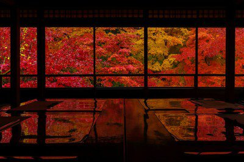

    ### 格調高い落ち着いた書院で、ゆったりと紅葉を楽しむ

    京都府・京都市左京区

    例年の色づき始め：10月初旬

    例年の紅葉見頃：2025年10月1日(水)～12月14日(日)

    -   行ってみたい：165
    -   行ってよかった：146

    ](/detail/ar0726e416761/)

-   [

    ## 成相寺の紅葉

    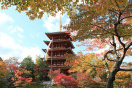

    ### 一幅の絵のように紅葉する姿に注目

    京都府・宮津市

    例年の色づき始め：11月中旬

    例年の紅葉見頃：11月中旬～11月下旬

    -   行ってみたい：243
    -   行ってよかった：139

    ](/detail/ar0726e12724/)

-   [

    ## 永観堂 禅林寺の紅葉

    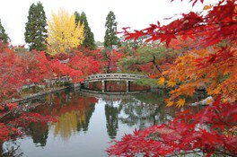

    ### 多宝塔を紅葉が包み込む

    京都府・京都市左京区

    例年の色づき始め：11月中旬

    例年の紅葉見頃：11月中旬～11月下旬

    -   行ってみたい：83
    -   行ってよかった：126

    ](/detail/ar0726e13137/)

-   [

    ## 嵯峨野トロッコ列車の紅葉

    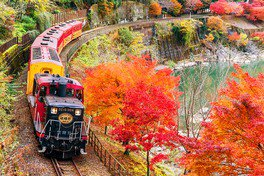

    ### 名勝嵐山を渡るトロッコ列車

    京都府・京都市右京区

    例年の色づき始め：11月上旬

    例年の紅葉見頃：11月中旬～12月上旬

    -   行ってみたい：123
    -   行ってよかった：89

    ](/detail/ar0726e372783/)

-   [

    ## 大本山 東福寺の紅葉

    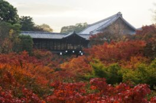

    ### 通天橋から望む渓谷に広がる紅葉は圧巻

    京都府・京都市東山区

    例年の色づき始め：11月中旬

    例年の紅葉見頃：11月下旬～12月上旬

    -   行ってみたい：39
    -   行ってよかった：59

    ](/detail/ar0726e13141/)

-   [

    ## 高雄(神護寺)の紅葉

    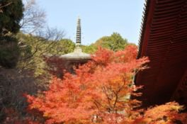

    ### 紅葉越しに見る神護寺の荘厳さはひときわ

    京都府・京都市右京区

    例年の色づき始め：11月上旬

    例年の紅葉見頃：11月上旬～11月下旬

    -   行ってみたい：37
    -   行ってよかった：53

    ](/detail/ar0726e12990/)

-   [

    ## 北野天満宮「史跡 御土居のもみじ苑」の紅葉

    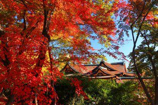

    ### 国宝御本殿と約350本の紅葉が織りなす絶景

    京都府・京都市上京区

    例年の色づき始め：11月中旬

    例年の紅葉見頃：2025年11月1日(土)～12月7日(日)

    -   行ってみたい：42
    -   行ってよかった：52

    ](/detail/ar0726e154656/)

-   [

    ## 鷹峯(源光庵)の紅葉

    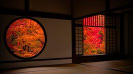

    ### 2つの有名な窓から眺める紅葉が見物

    京都府・京都市北区

    例年の色づき始め：11月上旬

    例年の紅葉見頃：11月中旬～11月下旬

    -   行ってみたい：54
    -   行ってよかった：48

    ](/detail/ar0726e13169/)

-   [

    ## 醍醐寺の紅葉

    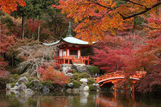

    ### 落葉広葉樹が魅せる見事な紅葉

    京都府・京都市伏見区

    例年の色づき始め：11月中旬

    例年の紅葉見頃：11月中旬～12月上旬

    -   行ってみたい：33
    -   行ってよかった：44

    ](/detail/ar0726e13144/)

-   [

    ## 仁和寺の紅葉

    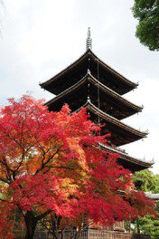

    ### 世界遺産と紅葉の情緒あふれるコラボ

    京都府・京都市右京区

    例年の色づき始め：10月下旬

    例年の紅葉見頃：11月上旬～12月上旬

    -   行ってみたい：38
    -   行ってよかった：43

    ](/detail/ar0726e322496/)

-   [1](/ranking/yokatta/ar0726/)
-   [2](/ranking/yokatta/ar0726/2.html)
-   [3](/ranking/yokatta/ar0726/3.html)
-   [4](/ranking/yokatta/ar0726/4.html)
-   [5](/ranking/yokatta/ar0726/5.html)
-   …
-   [10](/ranking/yokatta/ar0726/10.html)
-   [次へ](/ranking/yokatta/ar0726/2.html)

## 京都府の紅葉トピックス

### 京都府の見どころを紹介

[

京都の紅葉と楽しめる！日本三景・天橋立＆海辺のリゾート「メルキュール京都宮津リゾート＆スパ」をレポート

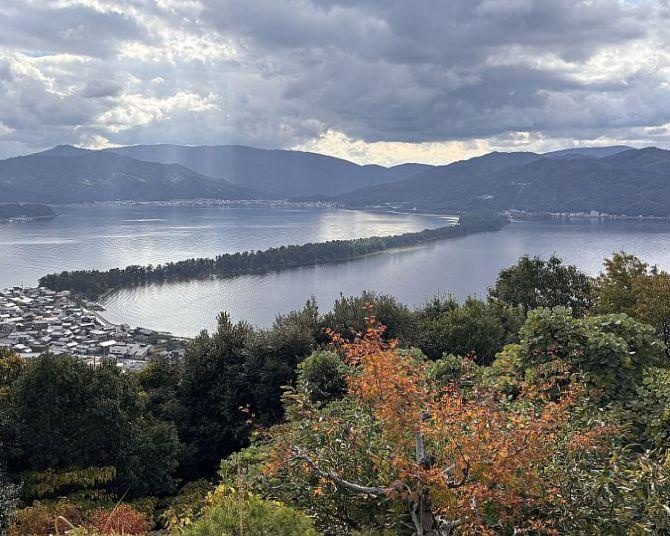

](/topics/article/1306479/)[

京都の紅葉見頃時期はいつ？2025年の最新情報やおすすめスポットもチェック！

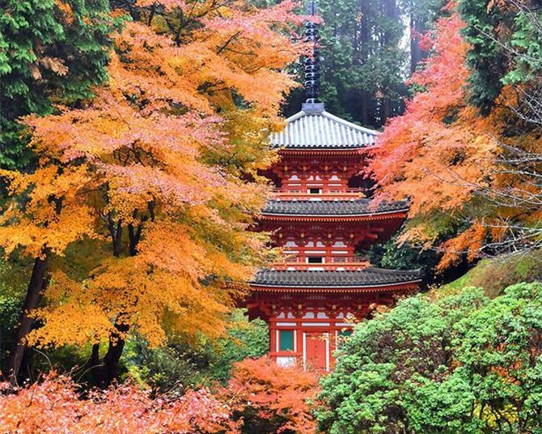

](/topics/article/1102019/)[

日本最古の京都府立植物園で夜の紅葉とアートイベント「LIGHT CYCLES KYOTO(ライトサイクル京都)」を楽しむ

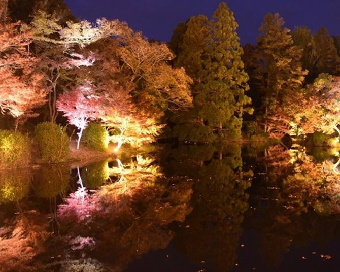

](/topics/article/1303934/)[

初心者にもおすすめ！絶景の紅葉が楽しめる登山、京都・鞍馬寺から貴船神社【見頃｜11月中旬〜11月下旬】

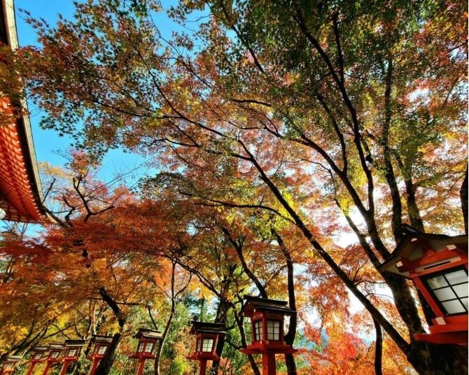

](/topics/article/1220709/)[

【京都・一乗寺】詩仙堂の額縁庭園の紅葉は息を飲む美しさ！おすすめ茶屋＆紅葉スポットを紹介

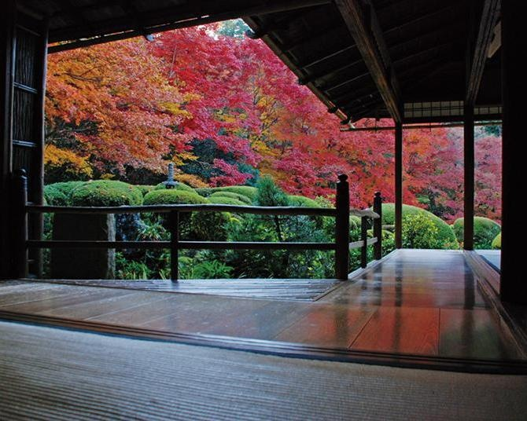

](/topics/article/1293340/)

### 京都府の紅葉Q＆A

2025年の京都府の紅葉見頃時期はいつ？

[京都府](/list/ar0726/)の紅葉見頃時期は例年11月中旬～12月上旬頃

京都府の人気の紅葉スポットはどこ？

アクセス数の多い京都府の人気紅葉スポットは、1位「[瑠璃光院の紅葉](/detail/ar0726e416761/)」、2位「[大本山 東福寺の紅葉](/detail/ar0726e13141/)」、3位「[醍醐寺の紅葉](/detail/ar0726e13144/)」（2026年4月10日更新）

[「京都府の紅葉名所人気ランキング」はこちら。](/ranking/ar0726/)

京都府でおすすめのライトアップのある紅葉スポットはどこ？

京都府でおすすめのライトアップのある紅葉スポットは、「[永観堂 禅林寺の紅葉」](/detail/ar0726e13137/)、「[醍醐寺の紅葉」](/detail/ar0726e13144/)、「[嵯峨野トロッコ列車の紅葉」](/detail/ar0726e372783/)。

[「京都府でライトアップのある紅葉スポットおすすめ10選」](/report/light/ar0726/)

京都府で紅葉祭りが楽しめるおすすめスポットはどこ？

京都府で紅葉祭りが楽しめるおすすめスポットは、「[大原(三千院)の紅葉」](/detail/ar0726e13166/)、「[嵐山の紅葉」](/detail/ar0726e13147/)、「[北野天満宮「史跡 御土居のもみじ苑」の紅葉」](/detail/ar0726e154656/)。

[「京都府で紅葉祭りが楽しめる紅葉スポットおすすめ10選」](/report/festival/ar0726/)

京都府の紅葉を見に行くとき、どんな服装や交通手段がおすすめ？

紅葉シーズンの京都府は昼夜で寒暖差があるため、重ね着できる服装がおすすめです。ストールやマフラーがあると安心です。紅葉スポットは坂道や砂利道を歩くことも多いので、スニーカーなど歩きやすい靴を選びましょう。見頃時期は道路が混み合うため、電車＋徒歩で移動するとスムーズです。

[X(旧Twitter)でシェア](javascript:void\(0\))[Facebookでシェア](javascript:void\(0\))

## 表記に関する説明

-   青葉

-   色づき始め

-   今見頃

-   色あせ始め

-   落葉

## 関西の紅葉名所ニュース

紅葉を見るならコチラもチェック！編集部がおすすめする最新記事！

-   [

    

    京都の紅葉と楽しめる！日本三景・天橋立＆海辺のリゾート「メルキュール京都宮津リゾート＆スパ」をレポート

    京都府

    2026年3月5日 23:30 更新](/topics/article/1306479/)
-   [

    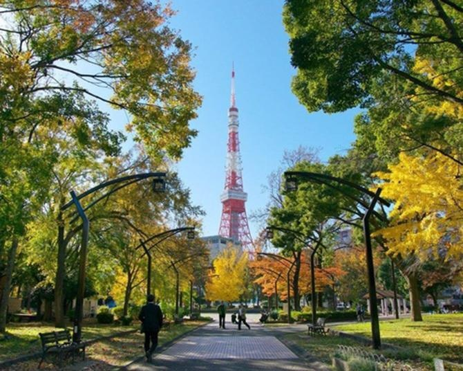

    12月6日・7日の紅葉見頃はここ！まだまだ見頃を楽しめる全国の紅葉名所ガイド

    全国

    2025年12月5日 10:01 更新](/topics/article/1311495/)
-   [

    

    京都の紅葉見頃時期はいつ？2025年の最新情報やおすすめスポットもチェック！

    京都府

    2025年11月28日 13:45 更新](/topics/article/1102019/)

[関西の紅葉名所ニュースをもっと見る](/topics/ar0700/)

## こだわり条件から京都府の紅葉名所を探す

人気のエリアから探す

-   [嵐山](/list/ar0726/ct14913/)
-   [金閣寺](/list/ar0726/ct14915/)
-   [宇治・南山城](/list/ar0726/ct15100/)
-   [修学院・大原](/list/ar0726/ct14908/)
-   [銀閣寺](/list/ar0726/ct14907/)
-   [福知山・舞鶴](/list/ar0726/ct14700/)
-   [祇園・東山](/list/ar0726/ct14905/)

ランキングから探す

[京都府の紅葉名所人気ランキング](/ranking/ar0726/)

[京都府の行ってみたい紅葉名所ランキング](/ranking/mitai/ar0726/)

[京都府の行ってよかった紅葉名所ランキング](/ranking/yokatta/ar0726/)

【京都府】ライトアップ・紅葉祭りなど条件から探す

-   [今見頃](/migoro/ar0726/)
-   [もうすぐ見頃](/soon/ar0726/)
-   [ライトアップ](/light/ar0726/)
-   [紅葉祭り開催](/festival/ar0726/)
-   [国指定名勝](/meisho/ar0726/)
-   [庭園・神社](/garden/ar0726/)
-   [駅から近い](/walk/ar0726/)
-   [黄(イチョウ等)](/yellow/ar0726/)
-   [赤(モミジ等)](/red/ar0726/)
-   [公園](/park/ar0726/)

【京都府】例年の見頃時期から探す

-   [例年9月見頃](/date0900/ar0726/)
-   [例年9月上旬見頃](/date0955/ar0726/)
-   [例年9月中旬見頃](/date0966/ar0726/)
-   [例年9月下旬見頃](/date0977/ar0726/)
-   [例年10月見頃](/date1000/ar0726/)
-   [例年10月上旬見頃](/date1055/ar0726/)
-   [例年10月中旬見頃](/date1066/ar0726/)
-   [例年10月下旬見頃](/date1077/ar0726/)
-   [例年11月見頃](/date1100/ar0726/)
-   [例年11月上旬見頃](/date1155/ar0726/)
-   [例年11月中旬見頃](/date1166/ar0726/)
-   [例年11月下旬見頃](/date1177/ar0726/)
-   [例年12月見頃](/date1200/ar0726/)
-   [例年12月上旬見頃](/date1255/ar0726/)
-   [例年12月中旬見頃](/date1266/ar0726/)
-   [例年12月下旬見頃](/date1277/ar0726/)

## こだわり条件から関西の紅葉名所を探す

周辺のエリア・都道府県から探す

-   [大阪府](/list/ar0727/)
-   [京都府](/list/ar0726/)
-   [兵庫県](/list/ar0728/)
-   [奈良県](/list/ar0729/)
-   [和歌山県](/list/ar0730/)
-   [滋賀県](/list/ar0725/)

ランキングから探す

[関西の紅葉名所人気ランキング](/ranking/ar0700/)

[関西の行ってみたい紅葉名所ランキング](/ranking/mitai/ar0700/)

[関西の行ってよかった紅葉名所ランキング](/ranking/yokatta/ar0700/)

[関西のライトアップ期間ありの紅葉名所ランキング](/ranking/light/ar0700/)

[関西の紅葉祭りランキング](/ranking/festival/ar0700/)

【関西】ライトアップ・紅葉祭りなど条件から探す

-   [今見頃](/migoro/ar0700/)
-   [もうすぐ見頃](/soon/ar0700/)
-   [ライトアップ](/light/ar0700/)
-   [紅葉祭り開催](/festival/ar0700/)
-   [国指定名勝](/meisho/ar0700/)
-   [庭園・神社](/garden/ar0700/)
-   [駅から近い](/walk/ar0700/)
-   [黄(イチョウ等)](/yellow/ar0700/)
-   [赤(モミジ等)](/red/ar0700/)
-   [公園](/park/ar0700/)

【関西】例年の見頃時期から探す

-   [例年9月見頃](/date0900/ar0700/)
-   [例年9月上旬見頃](/date0955/ar0700/)
-   [例年9月中旬見頃](/date0966/ar0700/)
-   [例年9月下旬見頃](/date0977/ar0700/)
-   [例年10月見頃](/date1000/ar0700/)
-   [例年10月上旬見頃](/date1055/ar0700/)
-   [例年10月中旬見頃](/date1066/ar0700/)
-   [例年10月下旬見頃](/date1077/ar0700/)
-   [例年11月見頃](/date1100/ar0700/)
-   [例年11月上旬見頃](/date1155/ar0700/)
-   [例年11月中旬見頃](/date1166/ar0700/)
-   [例年11月下旬見頃](/date1177/ar0700/)
-   [例年12月見頃](/date1200/ar0700/)
-   [例年12月上旬見頃](/date1255/ar0700/)
-   [例年12月中旬見頃](/date1266/ar0700/)
-   [例年12月下旬見頃](/date1277/ar0700/)

## 都道府県から紅葉名所を探す

[北海道](/list/ar0101/)

-   [北海道](/list/ar0101/)

[東　北](/list/ar0200/)

-   [宮城県](/list/ar0204/)([仙台](/list/ar0204/ct01900/))
-   [青森県](/list/ar0202/)
-   [岩手県](/list/ar0203/)
-   [秋田県](/list/ar0205/)
-   [山形県](/list/ar0206/)
-   [福島県](/list/ar0207/)

[関　東](/list/ar0300/)

-   [東京都](/list/ar0313/)
-   [神奈川県](/list/ar0314/)([箱根](/list/ar0314/ct08800/)・[鎌倉](/list/ar0314/ct08000/))
-   [千葉県](/list/ar0312/)
-   [埼玉県](/list/ar0311/)([秩父](/list/ar0311/ct07400/))
-   [群馬県](/list/ar0310/)
-   [栃木県](/list/ar0309/)([日光](/list/ar0309/ct02800/))
-   [茨城県](/list/ar0308/)

[甲信越](/list/ar0400/)

-   [山梨県](/list/ar0419/)
-   [長野県](/list/ar0420/)
-   [新潟県](/list/ar0415/)

[北　陸](/list/ar0500/)

-   [石川県](/list/ar0517/)([金沢](/list/ar0517/ct13102/))
-   [富山県](/list/ar0516/)
-   [福井県](/list/ar0518/)

[東　海](/list/ar0600/)

-   [愛知県](/list/ar0623/)([名古屋](/list/ar0623/ct11429/)・[豊田](/list/ar0623/ct12100/))
-   [岐阜県](/list/ar0621/)
-   [三重県](/list/ar0624/)
-   [静岡県](/list/ar0622/)([浜松](/list/ar0622/ct12300/))

[関　西](/list/ar0700/)

-   [大阪府](/list/ar0727/)
-   [京都府](/list/ar0726/)([嵐山](/list/ar0726/ct14913/))
-   [兵庫県](/list/ar0728/)([神戸](/list/ar0728/ct17902/)・[姫路](/list/ar0728/ct18400/))
-   [奈良県](/list/ar0729/)
-   [和歌山県](/list/ar0730/)
-   [滋賀県](/list/ar0725/)

[中　国](/list/ar0800/)

-   [広島県](/list/ar0834/)
-   [岡山県](/list/ar0833/)
-   [山口県](/list/ar0835/)
-   [鳥取県](/list/ar0831/)
-   [島根県](/list/ar0832/)

[四　国](/list/ar0900/)

-   [香川県](/list/ar0937/)
-   [愛媛県](/list/ar0938/)
-   [徳島県](/list/ar0936/)
-   [高知県](/list/ar0939/)

[九　州](/list/ar1000/)

-   [福岡県](/list/ar1040/)([北九州](/list/ar1040/ct22301/))
-   [佐賀県](/list/ar1041/)
-   [長崎県](/list/ar1042/)
-   [熊本県](/list/ar1043/)
-   [大分県](/list/ar1044/)
-   [宮崎県](/list/ar1045/)
-   [鹿児島県](/list/ar1046/)

## おすすめ情報

## 紅葉名所人気ランキング
【京都府】

2026年4月10日 更新

-   [

    1

    瑠璃光院の紅葉

    ](/detail/ar0726e416761/)
-   [

    2

    大本山 東福寺の紅葉

    ](/detail/ar0726e13141/)
-   [

    3

    醍醐寺の紅葉

    ](/detail/ar0726e13144/)
-   [

    4

    嵐山の紅葉

    ](/detail/ar0726e13147/)
-   [

    5

    嵯峨野トロッコ列車の紅葉

    ](/detail/ar0726e372783/)

[もっと見る](/ranking/ar0726/)

## 紅葉名所人気ランキング
【関西】

2026年4月10日 更新

-   [

    1

    吉野山(上千本)の紅葉

    ](/detail/ar0729e12748/)
-   [

    2

    メタセコイア並木の紅葉

    ](/detail/ar0725e12687/)
-   [

    3

    瑠璃光院の紅葉

    ](/detail/ar0726e416761/)
-   [

    4

    大本山 東福寺の紅葉

    ](/detail/ar0726e13141/)
-   [

    5

    醍醐寺の紅葉

    ](/detail/ar0726e13144/)

[もっと見る](/ranking/ar0700/)

## 閲覧履歴

-   最近見た紅葉スポットページはありません。

[閲覧履歴をもっと見る](/history/)

## おすすめ記事

-   [

    

    京都府でライトアップのあるおすすめ紅葉スポット30選

    ](/report/light/ar0726/)
-   [

    

    京都府で紅葉祭りが楽しめる紅葉スポットおすすめ17選

    ](/report/festival/ar0726/)
-   [

    

    京都府で紅葉が楽しめる庭園、寺・神社おすすめ30選

    ](/report/garden/ar0726/)

## 条件から紅葉名所を探す

-   [

    

    庭園・神社

    日本の伝統と紅葉に酔いしれる

    ](/garden/)
-   [

    

    ライトアップ

    昼とは違う景色を楽しむ

    ](/light/)
-   [

    

    駅から近い

    徒歩10分以内で行ける駅チカ紅葉名所を紹介

    ](/walk/)
-   [

    

    紅葉祭り

    紅葉と一緒にイベントも楽しもう

    ](/festival/)
-   [

    

    国指定名勝

    美しい景観にうっとり

    ](/meisho/)
-   [

    

    公園

    秋色に染まる園内を散策

    ](/park/)

## ランキングから紅葉名所を探す
【2025年版】

-   [

    

    紅葉名所ランキング

    アクセス数の多い人気紅葉スポットをランキング！

    ](/ranking/?utm_source=koyo&utm_medium=ranking-side&utm_campaign=navigate)
-   [

    

    行ってみたい紅葉ランキング

    みんなが行ってみたいと思っている紅葉スポットをランキング！

    ](/ranking/mitai/?utm_source=koyo&utm_medium=ranking-side&utm_campaign=navigate)
-   [

    

    行ってよかった紅葉ランキング

    みんなが行ってよかったと思った紅葉スポットをランキング！

    ](/ranking/yokatta/?utm_source=koyo&utm_medium=ranking-side&utm_campaign=navigate)
-   [

    

    ライトアップ紅葉ランキング

    アクセス数の多いライトアップ期間ありの紅葉スポットをランキング！

    ](/ranking/light/?utm_source=koyo&utm_medium=ranking-side&utm_campaign=navigate)
-   [

    

    紅葉祭りランキング

    アクセス数の多い紅葉祭り開催の紅葉スポットをランキング！

    ](/ranking/festival/?utm_source=koyo&utm_medium=ranking-side&utm_campaign=navigate)

## 紅葉をもっと楽しむ

-   [

    

    2025年の紅葉見頃時期予想(10/31更新)

    全国的に広範囲で平年並かやや遅い見頃となるところが多い見込み

    ](/topics/article/1007041/?utm_source=koyo&utm_medium=more-side&utm_campaign=navigate)
-   [

    

    【気象のプロに聞いた】続く酷暑で2025年紅葉はどうなる？

    各地の紅葉見頃や見頃を見逃さないポイントまで紹介

    ](/topics/article/1290604/?utm_source=koyo&utm_medium=more-side&utm_campaign=navigate)
-   [

    

    紅葉狩りの後は温泉へ

    露天風呂から紅葉が眺められる温泉も掲載中

    ](/onsen/list/?utm_source=koyo&utm_medium=more-side&utm_campaign=navigate)
-   [

    

    全国の人気紅葉名所10選！

    日本屈指の美しい紅葉が望める注目スポットをランキングでご紹介

    ](/topics2/zenkoku_spot/?utm_source=koyo&utm_medium=more-side&utm_campaign=navigate)
-   [

    

    もみじの種類や育て方

    もみじ・カエデの人気の種類10選！見分け方や育て方も紹介

    ](/topics/article/1007180/?utm_source=koyo&utm_medium=more-side&utm_campaign=navigate)

## pick up! 人気紅葉エリア
【2025年版】

-   [

    

    日光（栃木県）

    中禅寺湖湖畔・いろは坂・日光東照宮など

    ](/list/ar0309/ct02800/?utm_source=koyo&utm_medium=picup-side&utm_campaign=navigate)
-   [

    

    鎌倉（神奈川県）

    覚園寺・明月院・長谷寺など

    ](/list/ar0314/ct08000/?utm_source=koyo&utm_medium=picup-side&utm_campaign=navigate)
-   [

    

    箱根（神奈川県）

    長安寺・箱根登山鉄道の出山鉄橋(早川橋梁)・駒ヶ岳ロープウェーなど

    ](/list/ar0314/ct08800/?utm_source=koyo&utm_medium=picup-side&utm_campaign=navigate)
-   [

    

    嵐山（京都府）

    渡月橋・高雄(神護寺)・嵯峨野トロッコ列車など

    ](/list/ar0726/ct14913/?utm_source=koyo&utm_medium=picup-side&utm_campaign=navigate)
-   [

    

    祇園・東山（京都府）

    清水寺・建仁寺・知恩院など

    ](/list/ar0726/ct14905/?utm_source=koyo&utm_medium=picup-side&utm_campaign=navigate)

## おすすめ特集

-   [

    

    花火特集2025

    2025年の花火大会情報をお届け！開催・中止・延期情報も掲載

    ](https://hanabi.walkerplus.com/?utm_source=koyo&utm_medium=side&utm_campaign=season)