# 【2026京都飯店心得】精選20間高CP值京都住宿推薦，近市中心！

> 作者: panda_tranel_fish
> 发布时间: 2026-03-14T10:45:00+08:00
> 原文链接: https://pandafishtravel.tw/hotel/archives/3025/

---

# 【2026京都飯店心得】精選20間高CP值京都住宿推薦，近市中心！

by [熊貓愛吃魚](https://pandafishtravel.tw/author/pandafishtwgmail-com/) 2026 年 3 月 14 日

**Published:** 2026 年 3 月 14 日**Last Updated on** 2026 年 3 月 15 日

每到櫻花季、楓葉季的時候，日本京都絕對是熱門景點之一，想到日本古都許多人想到的也是京都，相當的古色古香及滿滿的人文氣息，同時京都住宿也能感受到很明顯日本文化，京都市內也有許多建築物被列為世界文化遺產，蠻推薦可以住[京都飯店](https://www.pandafishtravel.tw/hotel/archives/3025/)，花個幾天好好深入了解京都這個城市的魅力。

精選20間京都飯店，鄰近京都車站、三條通、花間小路及清水寺的[京都住宿推薦](https://www.pandafishtravel.tw/hotel/archives/3025/)，找平價親子的京都民宿看這篇就夠！

文章摘要

-   [熱門京都飯店區域攻略](#i)
    -   
-   [京都住宿推薦｜京都車站](#i-3)
    -   [1.京阪京都站南飯店](#1)
    -   [2.京都梅小路花傳抄](#2)
    -   [3\. 京都千飯店 (THE THOUSAND KYOTO)](#3_THE_THOUSAND_KYOTO)
    -   [5\. 京都花宿 (Kyoto Hana Hostel)](#5_Kyoto_Hana_Hostel)
    -   [6\. 京都格蘭比亞大酒店 (Hotel Granvia Kyoto)](#6_Hotel_Granvia_Kyoto)
    -   [7.櫻花台畫廊飯店](#7)
-   [京都住宿推薦｜京都三条](#i-4)
    -   [1.三井花園酒店京都三條尊貴](#1-2)
    -   [2.京都十字飯店](#2-2)
    -   [3\. 京都河原町三條Resol飯店](#3_Resol)
    -   [4\. 索拉利亞西鐵飯店-京都Premier](#4_-Premier)
-   [京都住宿推薦｜京都四条](#i-5)
    -   [1\. M’s Plus 四條大宮酒店](#1_Ms_Plus)
    -   [2\. M’s INN 東山賓館 (M’s Inn Higashiyama)](#2_Ms_INN_M8217s_Inn_Higashiyama)
    -   [3.京都四條大宮旅客之家飯店](#3)
    -   [4\. 三井花園飯店京都四條](#4)
    -   [5\. 京都四條皇家花園酒店](#5)
    -   [6\. 京都祇園賽萊斯廷酒店](#6)
-   [京都住宿推薦｜京都五条](#i-6)
    -   [1.京都烏丸五條京王普雷利亞飯店](#1-3)
    -   [2.sequence飯店-京都五条](#2sequence)
    -   [3.京都清水五條相鐵FRESA INN](#3FRESA_INN)
-   [京都住宿心得總結](#i-7)
-   [京都住宿評價](#i-8)
-   [京都住宿常見問題 Q&A](#_QA)

## 熱門京都飯店區域攻略

想找京都的住宿，推薦大家可以從以下幾個點去尋找喔，可以選擇的飯店民宿也很多！

房價部分以淡季看大約**1000多就有不錯的飯店**可以選擇，若要4-5星的京都飯店，**平日差不多三千以上，**若是想要預訂櫻花季、楓葉季的[京都飯店](https://www.pandafishtravel.tw/hotel/archives/3025/)，建議提前3-4個月預訂，選擇才會相對比較多呦。

-   **京都車站周邊**，如果除了京都外還有安排去其他地方，像大阪、東京等等，入住京都車站周邊的飯店會比較方便喔～
-   **京都三条通**，不喜歡太過熱鬧，但交通機能又方便的話首推三條通周邊的京都飯店，相對安靜，但如果需要採買要裝或者吃美食，京都三條通會是不錯的選擇。
-   **京都四条通**，一想找繁華熱鬧的地方，推薦可以找四条通的住宿，晚上想逛街買吃的四条通最方便了。
-   京都五条通，相較於其他京都住宿，周邊環境更加清幽安靜，價格上也相對實惠。

這裡推薦幾間在京都非常有特色的住宿，我都有把他們的特點個別的寫出來，大家都可以去參考一下。

-   **小資型、高CP值住宿：**京都烏丸五條京王普雷利亞飯店、京都河原町三條Resol飯店
-   **家長最愛，親子家庭的飯店推薦：**三井花園酒店京都三條尊貴、京都格蘭比亞大酒店
-   **超美設計感，網美打卡住宿：**京都四條室町Resol飯店、京都河原町三條Resol飯店
-   **新開幕京都飯店推薦：**三井花園酒店京都三條尊貴

-   **地理位置、機能佳：**京阪京都站南飯店、櫻花台畫廊飯店
-   **飯店設有溫泉可以使用：**京都梅小路花傳抄、櫻花台畫廊飯店

## 京都住宿推薦｜京都車站

### **1.[京阪京都站南飯店](https://www.agoda.com/zh-tw/hotel-keihan-kyotoeki-minami/hotel/hatasho-cho-jp.html?cid=1895872)**

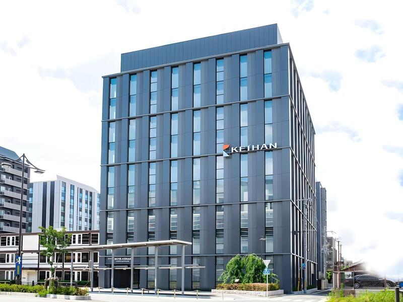

**【綜合評分】：4.4**/5

**【房型價格】：**經濟雙床房 TWD $2,000起 | 標準三人房 TWD $2,700起**[(更多房型)](https://www.agoda.com/zh-tw/hotel-keihan-kyotoeki-minami/hotel/hatasho-cho-jp.html?cid=1895872)**

**【限時優惠】：[Agoda](https://www.agoda.com/zh-tw/hotel-keihan-kyotoeki-minami/hotel/hatasho-cho-jp.html?cid=1895872) | [Booking](https://www.booking.com/hotel/jp/hotel-keihan-kyotoeki-minami.zh-tw.html?aid=7945213)**

**【周邊景點】：**京都車站250公尺

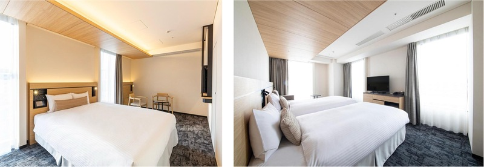

-   地理位置佳：飯店位置就在京都車站門口，搭乘近鐵、 JR或是地鐵都非常方便，甚至機場巴士也可以，在機能上還有唐吉軻德、Aeon等便利商店，便利性非常高。
-   相較於其他京都住宿，性價比很高，價格也平價，而且位置也非常好！
-   飯點每天下午皆會有免費的迎賓飲料可以自行拿取，像是咖啡、氣泡飲等等。
-   若需要備品的話，櫃檯旁也有牙刷、乳液及化妝水等等可以自取，除此之外也有電棒捲、充電線可以跟櫃台租借。
-   房間內的電視還可以連結Youtube，另外也可以從房間看到洗衣機目前的使用狀況。

### **2.**[京都梅小路花傳抄](https://www.agoda.com/zh-tw/kyoto-umekoij-kadensho/hotel/kyoto-jp.html?cid=1895872)

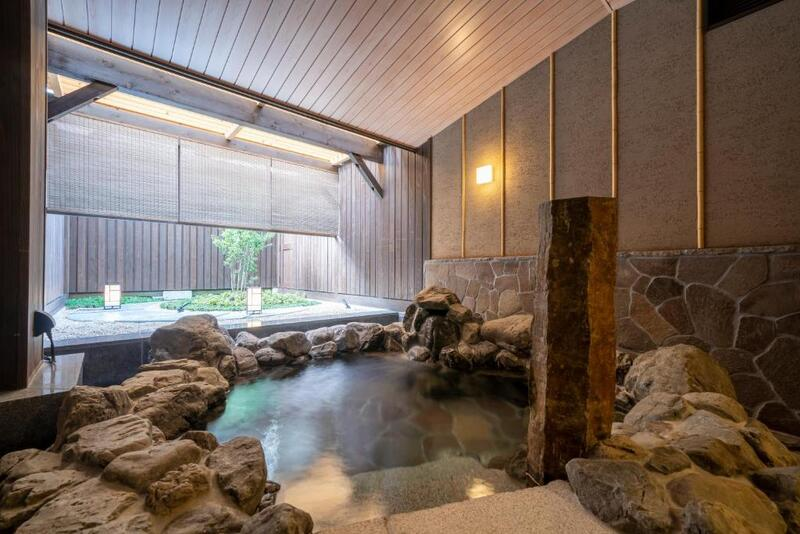

**【綜合評分】：4.3**/5

**【房型價格】：**三人房 TWD $6,600起 | 家庭四人房 TWD $10,000起**[(更多房型)](https://www.agoda.com/zh-tw/kyoto-umekoij-kadensho/hotel/kyoto-jp.html?cid=1895872)**

**【限時優惠】：[Agoda](https://www.agoda.com/zh-tw/kyoto-umekoij-kadensho/hotel/kyoto-jp.html?cid=1895872) | [Booking](https://www.booking.com/hotel/jp/kyoto-umekoij-kadensho.zh-tw.html?aid=7945213)**

**【周邊景點】：**京都車站1.6公里

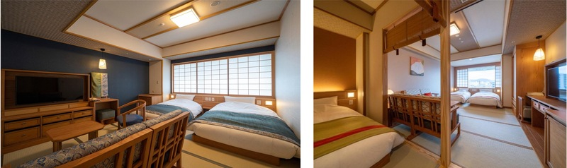

-   以日式溫泉旅館為主軸，除了有著傳統日式旅館的氛圍，也有融入現代風雅感。
-   旅館內除了有大浴場外，還露天浴池及桑拿可以使用，房間電視也能看目前的擁擠程度。
-   最大的特色，飯店還有5間不同主題的私人湯屋，通通都是免費，無需預約只要沒人就可以使用，非常適合情侶、有刺青的旅客都可以享有獨立空間。
-   泡完湯之後，飯店在休息室還有提供冰棒、養樂多等點心。晚賞還有宵夜拉麵可以吃，另外還有迎賓飲料咖啡、茶甚至還有酒精飲品！
-   如果有帶小朋友的話，飯店也會提供嬰兒床、兒童牙刷等備品，加上飯店整個室內空間都是鋪設榻榻米，不用擔心幼兒在地板上爬行。

[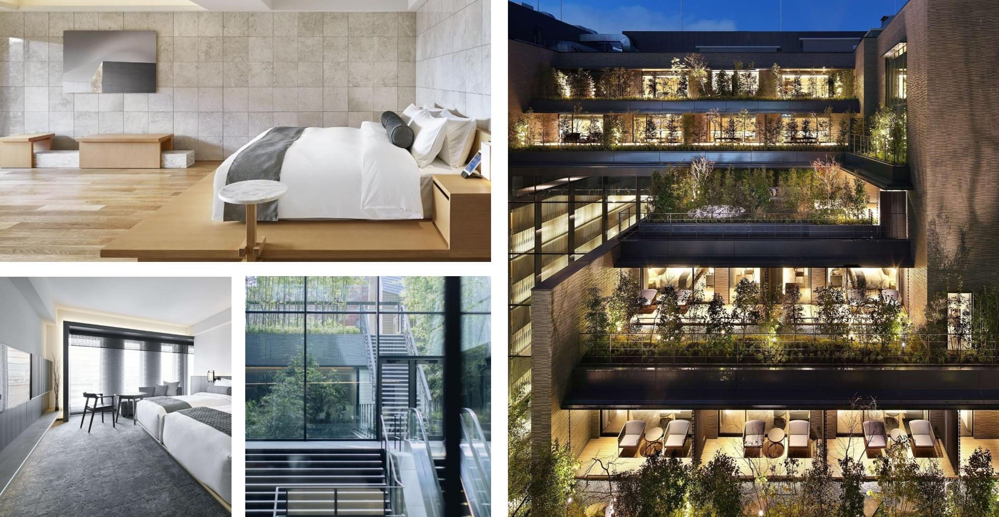](https://www.agoda.com/zh-tw/the-thousand-kyoto/hotel/kyoto-jp.html?cid=1895872)

### **3\. [京都千飯店 (THE THOUSAND KYOTO)](https://www.agoda.com/zh-tw/the-thousand-kyoto/hotel/kyoto-jp.html?cid=1895872)**

**推薦原因 |** 近幾年才新開幕的京都飯店，飯店沒有浮誇的設計，簡約精緻非常有五星級奢華感，到京都車站只要3分鐘，位置很好超級方便，每位遇到的服務人員都非常親切專業，房間寬敞乾淨，行李箱平放完全沒問題，很適合想住[高級京都住宿](https://www.pandafishtravel.tw/hotel/archives/3025/)的朋友。

-   **飯店評分：4.4** / 5
-   **限時優惠：[Booking](https://www.booking.com/hotel/jp/the-thousand-kyoto.zh-tw.html?aid=7945213) | [Agoda](https://www.agoda.com/zh-tw/the-thousand-kyoto/hotel/kyoto-jp.html?cid=1895872)**
-   **住宿類型：**朋友、家庭、情侶
-   **周邊景點：**距離京都站230公尺
-   **房型價格：**高級房 TWD $4,300起 / 頂級露台雙床房 TWD $18,000起**[(更多房型)](https://www.agoda.com/zh-tw/the-thousand-kyoto/hotel/kyoto-jp.html?cid=1895872)**

[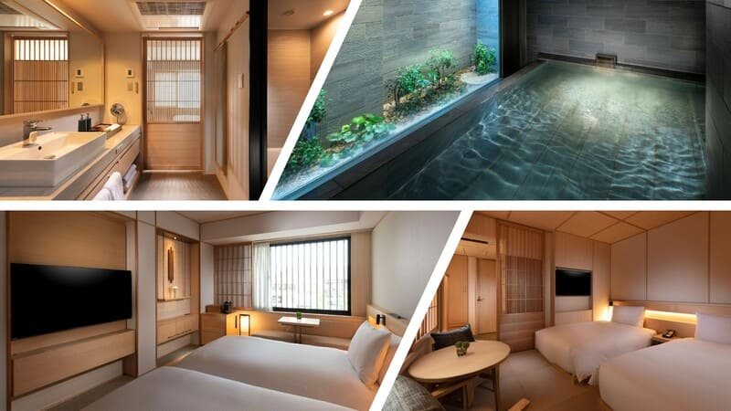](https://www.agoda.com/zh-tw/hotel-senren-kyoto-higashiyama-kiyomizu-h21760763/hotel/kyoto-jp.html?cid=1895872)

#### **4\. [DoubleTree by Hilton Kyoto Higashiyama
](https://www.agoda.com/zh-tw/hotel-senren-kyoto-higashiyama-kiyomizu-h21760763/hotel/kyoto-jp.html?cid=1895872)**

**推薦原因 |** 飯店非常新，2023年8月左右才開幕，工作人月都相當的親切有善，有別於原本希爾頓的簡約精緻感，因為座落於京都這座古城，房間內也可以感受到濃濃的日本元素，飯店位置也非常好，不管是想要去地點站或者是清水寺都是步行就可以抵達，評價蠻不錯的[新開幕京都飯店](https://www.pandafishtravel.tw/hotel/archives/3025/)。

-   **飯店評分：4.4** / 5
-   **限時優惠：[Agoda](https://www.agoda.com/zh-tw/hotel-senren-kyoto-higashiyama-kiyomizu-h21760763/hotel/kyoto-jp.html?cid=1895872) | [Booking](https://www.booking.com/hotel/jp/hoteru-senrenjing-du-dong-shan-qing-shui.zh-tw.html?aid=7945213)**
-   **住宿類型：**朋友、家庭、情侶
-   **周邊景點：**距離清水五條站140公尺
-   **房型價格：**逸林雙床房 TWD $4,300起 / 豪華套房 TWD $11,000起**[(更多房型)](https://www.agoda.com/zh-tw/hotel-senren-kyoto-higashiyama-kiyomizu-h21760763/hotel/kyoto-jp.html?cid=1895872)**

[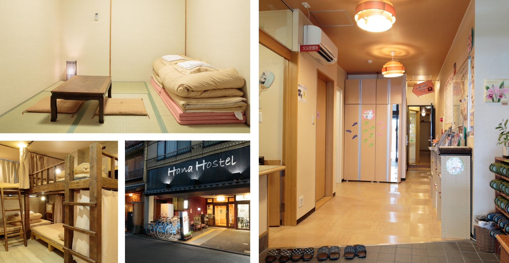](https://www.agoda.com/zh-tw/kyoto-hana-hostel/hotel/kyoto-jp.html?cid=1895872)

### **5\. [京都花宿 (Kyoto Hana Hostel)](https://www.agoda.com/zh-tw/kyoto-hana-hostel/hotel/kyoto-jp.html?cid=1895872)**

**推薦原因 |** 相當鄰近京都車站的住宿，京都花宿的服務人員都非常親切向朋友一樣，除了有適合背包客的上下床類型，也有獨立衛浴的房型，日式傳統的和室房非常舒服，棉被寢具等都非常柔軟，附近也有超商及店家，想買東西吃也很方便，值得推薦的京都民宿。

-   **飯店評分：4.4** / 5
-   **限時優惠：[Booking](https://www.booking.com/hotel/jp/hybrid-inn-kyoto-hana-hostel.zh-tw.html?aid=7945213) | [Agoda](https://www.agoda.com/zh-tw/kyoto-hana-hostel/hotel/kyoto-jp.html?cid=1895872)**
-   **住宿類型：**朋友、背包客
-   **周邊景點：**距離京都站460公尺
-   **房型價格：**日式雙人房 TWD $990起 / 日式標準房 TWD $1,400起**[(更多房型)](https://www.agoda.com/zh-tw/kyoto-hana-hostel/hotel/kyoto-jp.html?cid=1895872)**

[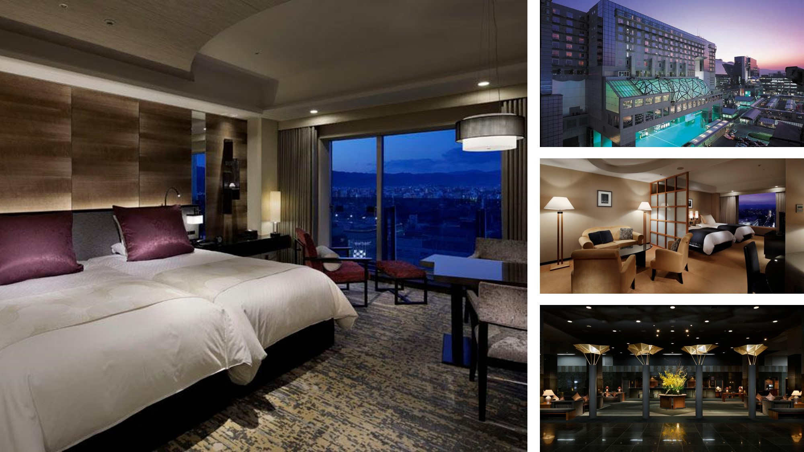](https://www.agoda.com/zh-tw/hotel-granvia-kyoto/hotel/kyoto-jp.html?cid=1895872)

### **6\. [京都格蘭比亞大酒店 (Hotel Granvia Kyoto)](https://www.agoda.com/zh-tw/hotel-granvia-kyoto/hotel/kyoto-jp.html?cid=1895872)**

**推薦原因 |** 跟京都車站連通在一起，拖行李也不會累，交通位置真的非常好，下次找京都飯店會再考慮入住，算是在京都最熱鬧的地方，所以機能還不錯找餐廳買東西都很方便，房間算是蠻寬敞的，還有空間可以走路，遇到的服務人員都蠻親切的~

-   **飯店評分：4.3** / 5
-   **限時優惠：[Booking](https://www.booking.com/hotel/jp/granvia-kyoto-kyoto.zh-tw.html?aid=7945213) | [Agoda](https://www.agoda.com/zh-tw/hotel-granvia-kyoto/hotel/kyoto-jp.html?cid=1895872)**
-   **住宿類型：**朋友、家庭、親子
-   **周邊景點：**距離京都站140公尺
-   **房型價格：**大房 TWD $3,400起 / 小型雙床間套房 TWD $10,000起**[(更多房型)](https://www.agoda.com/zh-tw/hotel-granvia-kyoto/hotel/kyoto-jp.html?cid=1895872)**

### **7.[櫻花台畫廊飯店](https://www.agoda.com/zh-tw/sakura-terrace-the-gallery/hotel/kyoto-jp.html?cid=1895872)**

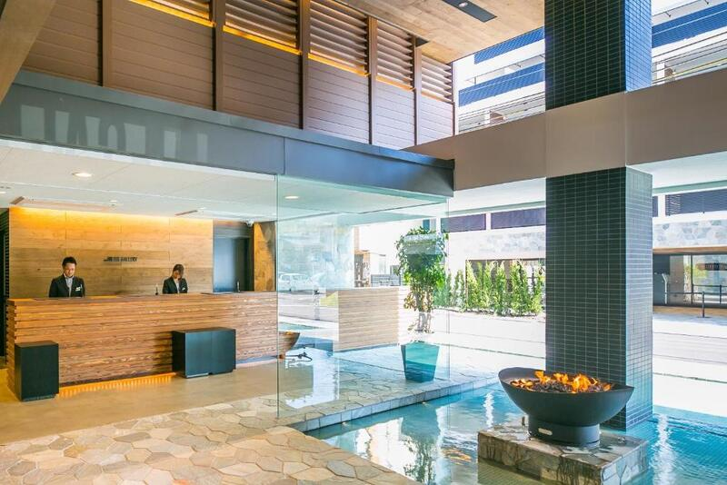

**【綜合評分】：4.4**/5

**【房型價格】：**標準雙床房 TWD $4,600起 | 頂樓雙人房 TWD $7,600起**[(更多房型)](https://www.agoda.com/zh-tw/sakura-terrace-the-gallery/hotel/kyoto-jp.html?cid=1895872)**

**【限時優惠】：[Agoda](https://www.agoda.com/zh-tw/sakura-terrace-the-gallery/hotel/kyoto-jp.html?cid=1895872) | [Booking](https://www.booking.com/hotel/jp/sakura-terrace-the-gallery.zh-tw.html?aid=7945213)**

**【周邊景點】：**京都站340公尺

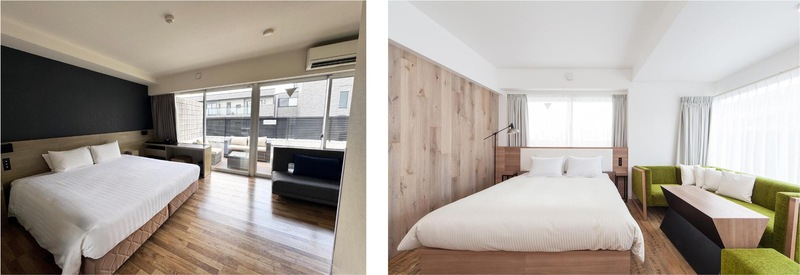

-   住客皆享有一杯迎賓飲品可以選擇，從無酒精到紅白酒通通都可以選擇。另外飯店大廳有放置咖啡機、熱茶等等，若有需要隨時都可以使用。
-   另外飯店也有提供大浴場跟三溫暖可以使用，走完一整天回到飯店可以泡澡放鬆一下，蠻貼心的是在女生浴場還有設置密碼才能進入，非常貼心！
-   與其他[京都住宿](https://www.pandafishtravel.tw/hotel/archives/3025/)比起來，房間非常的寬敞，行李箱甚至還可以攤開。
-   地理位置佳：鄰近京都車站、便利商店，甚至走路10分鐘就有唐吉軻德、AEON，交通跟生活機能都非常方便。
-   早餐部分更是飯店的一大亮點，選擇非常多樣化，中西日式通通都有，評分非常高的京都住宿早餐。

## 京都住宿推薦｜京都三条

### **1.[三井花園酒店京都三條尊貴](https://www.agoda.com/zh-tw/kyoto-sanjo-hotel-tentative-name/hotel/kyoto-jp.html?cid=1895872)**

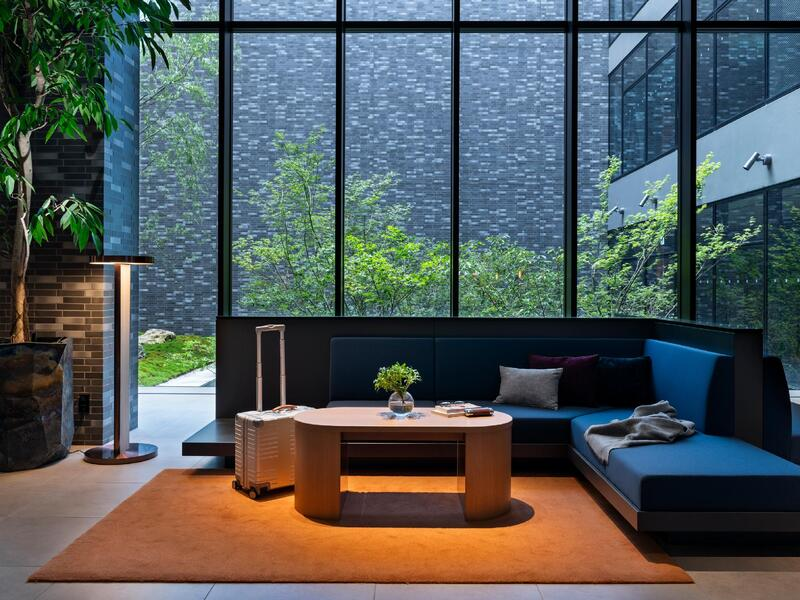

**【綜合評分】：4.6**/5

**【房型價格】：**高級雙床房 TWD $5,800起 | 高級雙人房 TWD $6,100起**[(更多房型)](https://www.agoda.com/zh-tw/kyoto-sanjo-hotel-tentative-name/hotel/kyoto-jp.html?cid=1895872)**

**【限時優惠】：[Agoda](https://www.agoda.com/zh-tw/kyoto-sanjo-hotel-tentative-name/hotel/kyoto-jp.html?cid=1895872) | [Booking](https://www.booking.com/hotel/jp/san-jing-gadenhoterujing-du-san-tiao-puremia.zh-tw.html?aid=7945213)**

**【周邊景點】：**烏丸御池站300公尺

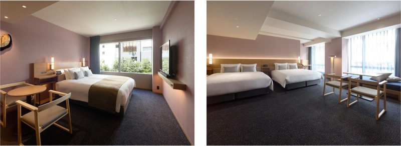

-   三井飯店第一的私人SPA，採完全包廂式，而且還有免費的飲料零食可以自行拿取，非常適合家庭旅客。
-   飯店還有大浴場可以泡澡，走完一整天非常需要舒緩放鬆，而且提供的備品設施也非常好，像是Refa吹風機及雪肌精的化妝水、卸妝乳都可以使用。
-   飯店甚至還設有洗衣機的房型，不用跟其他客人搶著用洗衣機，非常適合親子家庭需要長住的旅客。
-   2024年7月才新開幕的[京都住宿](https://www.pandafishtravel.tw/hotel/archives/3025/)！所有設備都還維持的非常新！
-   飯店早餐算是非常有特色，採義大利半自助式的風格，並加入了飯店內的起司製造所的新鮮起司。

### **2.****[京都十字飯店](https://www.agoda.com/zh-tw/cross-hotel-kyoto/hotel/kyoto-jp.html?cid=1895872)**

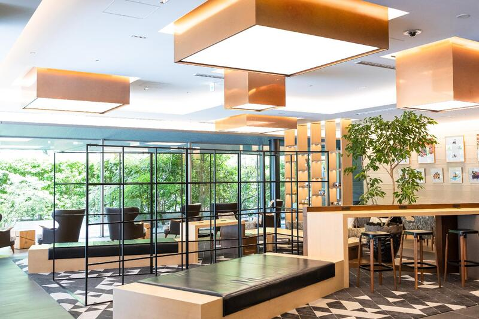

**【綜合評分】：4.6**/5

**【房型價格】：**標準雙人房 TWD $2,700起 | 豪華家庭房 TWD $5,600起**[(更多房型)](https://www.agoda.com/zh-tw/cross-hotel-kyoto/hotel/kyoto-jp.html?cid=1895872)**

**【限時優惠】：[Agoda](https://www.agoda.com/zh-tw/cross-hotel-kyoto/hotel/kyoto-jp.html?cid=1895872) | [Booking](https://www.booking.com/hotel/jp/cross-hotel-kyoto.zh-tw.html?aid=7945213)**

**【周邊景點】：**三條京阪站350公尺

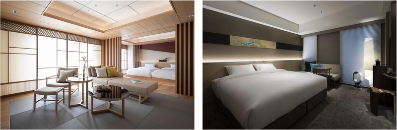

-   地理位置佳：飯店就在京都市區，搭乘地鐵、電車通通步行就可以到，另外周邊也有不少便利商店、唐吉軻德等等，地理位置非常好的京都飯店。
-   溝通順暢：服務人員的英文也都非常流利順暢，在溝通上基本都沒有問題。
-   現代硬體設施：房間內還有提供 DYSON 加濕器、藍芽音響，另外也有做完全的乾濕分離，還有提供浴鹽可以在房間內泡澡。
-   早餐選擇豐富：早餐算是京都十字飯店蠻大的特色，包括日式西式通通都有，甚至還有牛排、明太子蛋捲以及抹茶拿鐵等等，但因為菜色變化不大，建議連住旅客可以吃1-2天就好。
-   親子友善：如果有帶嬰幼兒的話，飯店還有嬰兒床可以租借，記得事先跟飯店詢問！

[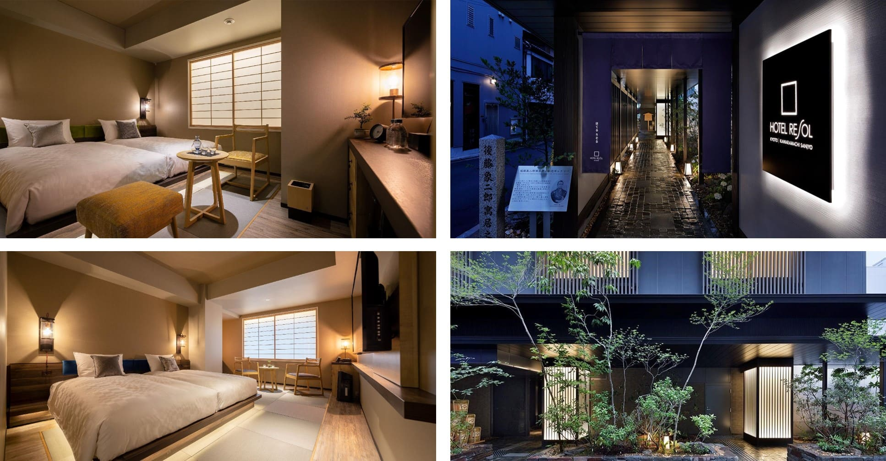](https://www.agoda.com/zh-tw/hotel-resol-kyoto-kawaramachi-sanjo_2/hotel/kyoto-jp.html?cid=1895872)

### **3\. [京都河原町三條Resol飯店](https://www.agoda.com/zh-tw/hotel-resol-kyoto-kawaramachi-sanjo_2/hotel/kyoto-jp.html?cid=1895872)**

**推薦原因 |** 京都河原町三條Resol飯店附近就有公車站牌，去京都各大景點都蠻方便，離地下鐵也不遠，房間算蠻寬敞的，行李箱還有打開的空間，房間蠻有日式的風格，另外還有抹茶粉可以自己泡，飯店週邊的機能算不錯，要買吃的或者是藥妝店都很近。

-   **飯店評分：4.4** / 5
-   **限時優惠：[Booking](https://www.booking.com/hotel/jp/hoterurisorujing-du-he-yuan-ting-san-tiao.zh-tw.html?aid=7945213) | [Agoda](https://www.agoda.com/zh-tw/hotel-resol-kyoto-kawaramachi-sanjo_2/hotel/kyoto-jp.html?cid=1895872)**
-   **住宿類型：**朋友、家庭、情侶
-   **周邊景點：**距離地下鐵河原町站460公尺
-   **房型價格：**日式現代客房  TWD $1,700起 / 好萊塢豪華房 TWD $2,600起**[(更多房型)](https://www.agoda.com/zh-tw/hotel-resol-kyoto-kawaramachi-sanjo_2/hotel/kyoto-jp.html?cid=1895872)**

[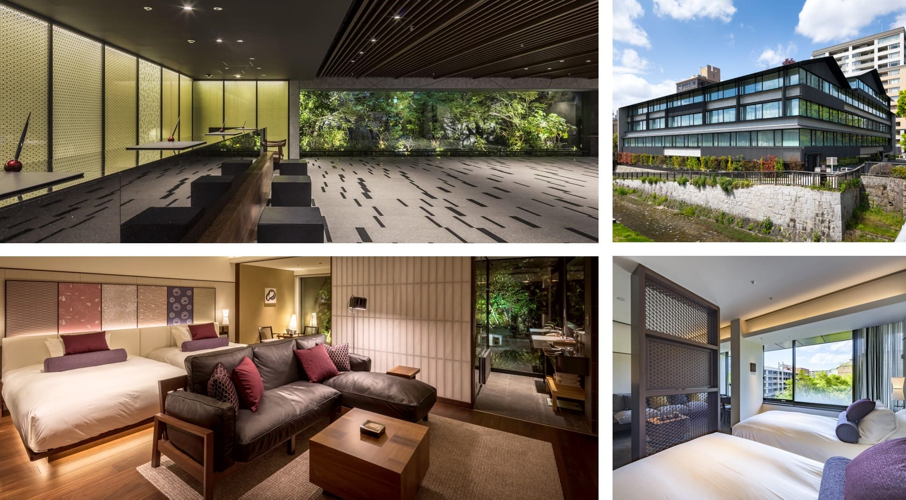](https://www.agoda.com/zh-tw/solaria-nishitetsu-hotel-kyoto-premier/hotel/kyoto-jp.html?cid=1895872)

### **4\. [索拉利亞西鐵飯店-京都Premier](https://www.agoda.com/zh-tw/solaria-nishitetsu-hotel-kyoto-premier/hotel/kyoto-jp.html?cid=1895872)**

**推薦原因 |** 飯店距離地鐵站大概走5分鐘就能抵達，去各大景點算蠻方便的，就在鴨川附近，還可以散步走走，晚上算蠻安靜的，飯店的地下室還有溫泉可以泡，裝潢設計也很有質感，房間的空間比想像中的大，房間還有浴缸可以泡。

-   **飯店評分：4.4** / 5
-   **限時優惠：[Booking](https://www.booking.com/hotel/jp/solaria-nishitetsu-hotel-kyoto-premier.zh-tw.html?aid=7945213) | [Agoda](https://www.agoda.com/zh-tw/solaria-nishitetsu-hotel-kyoto-premier/hotel/kyoto-jp.html?cid=1895872)**
-   **住宿類型：**家庭、情侶
-   **周邊景點：**距離地下鐵三條京阪站300公尺
-   **房型價格：**景觀房 TWD $3,900起 / 河景套房 TWD $10,000起**[(更多房型)](https://www.agoda.com/zh-tw/solaria-nishitetsu-hotel-kyoto-premier/hotel/kyoto-jp.html?cid=1895872)**

## 京都住宿推薦｜京都四条

[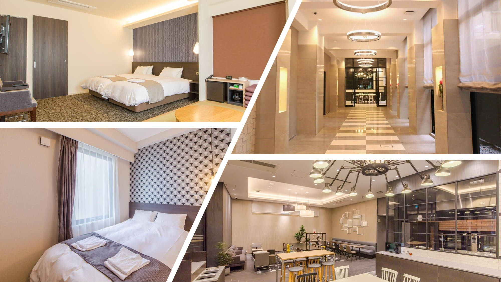](https://www.agoda.com/zh-hk/hotel-m-s-plus-shijo-omiya/hotel/kyoto-jp.html?cid=1895872)

### **1\. [M’s Plus 四條大宮酒店](https://www.agoda.com/zh-hk/hotel-m-s-plus-shijo-omiya/hotel/kyoto-jp.html?cid=1895872)**

**推薦原因 |** 房間空間不算很大，但該有的品項都有，飯店的位置也很不錯，要去各大景點都很方便，除了地下鐵也有公車，早餐是現烤的麵包跟一些果汁咖啡，飯店也有會說中文的服務人員，溝通起來沒有問題，服務態度也非常好，京都住宿的首選~

-   **飯店評分：4.2** / 5
-   **限時優惠：[Booking](https://www.booking.com/hotel/jp/ms-plus-shijo-omiya.zh-tw.html?aid=7945213) | [Agoda](https://www.agoda.com/zh-hk/hotel-m-s-plus-shijo-omiya/hotel/kyoto-jp.html?cid=1895872)**
-   **住宿類型：**朋友、家庭
-   **周邊景點：**距離地下鐵四條站430公尺
-   **房型價格：**小型雙人房 TWD $890起 / 和洋室客房 TWD $2,300起**[(更多房型)](https://www.agoda.com/zh-hk/hotel-m-s-plus-shijo-omiya/hotel/kyoto-jp.html?cid=1895872)**

[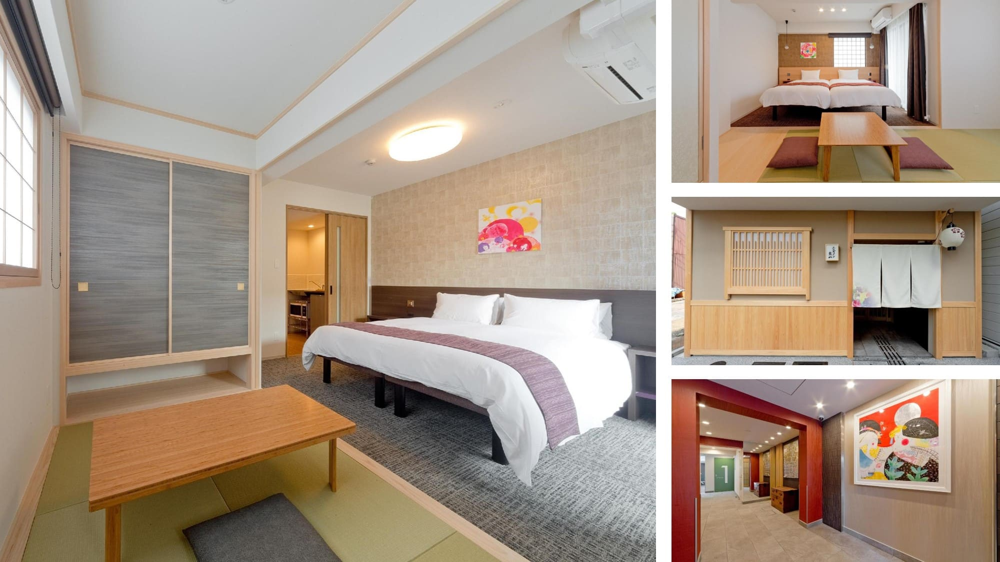](https://www.agoda.com/zh-tw/m-s-inn-higashiyama/hotel/kyoto-jp.html?cid=1895872)

### **2\. [M’s INN 東山賓館 (M’s Inn Higashiyama)](https://www.agoda.com/zh-tw/m-s-inn-higashiyama/hotel/kyoto-jp.html?cid=1895872)**

**推薦原因 |** 整個民宿的感覺非常舒適，房間裡還有附洗烘脫衣機，連洗衣粉也有附，非常貼心，大概走10分鐘就能抵達祇園四條站，是無人的京都民宿都採電子化設計，在小巷子內鬧中取靜的感覺，鄰近清水寺花見小路等各大景點，有帶小朋友也推薦的[京都民宿](https://www.pandafishtravel.tw/hotel/archives/3025/)。

-   **飯店評分：4.5** / 5
-   **限時優惠：[Booking](https://www.booking.com/hotel/jp/ms-inn-higashiyama.zh-tw.html?aid=7945213) | [Agoda](https://www.agoda.com/zh-tw/m-s-inn-higashiyama/hotel/kyoto-jp.html?cid=1895872)**
-   **住宿類型：**家庭、朋友
-   **周邊景點：**距離祇園四條站550公尺
-   **房型價格：**豪華雙人房 TWD $760起 / 高級雙人間 TWD $1,900起**[(更多房型)](https://www.agoda.com/zh-tw/m-s-inn-higashiyama/hotel/kyoto-jp.html?cid=1895872)**

### **3.[京都四條大宮旅客之家飯店](https://www.agoda.com/zh-tw/travelodge-kyoto-shijo-omiya/hotel/kyoto-jp.html?cid=1895872)**

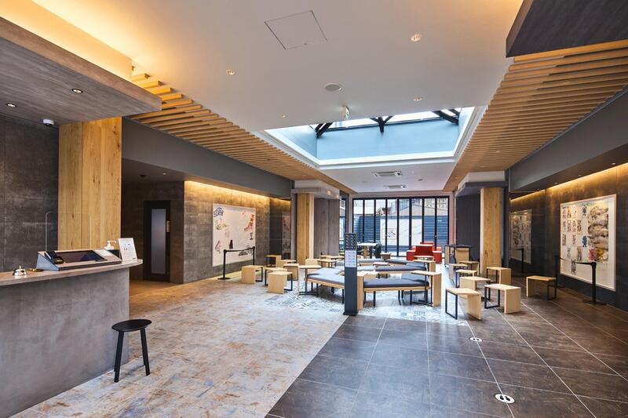

**【綜合評分】：4.5**/5

**【房型價格】：**標準雙人房 TWD $1,000起 | 家庭四人房 TWD $2,300起**[(更多房型)](https://www.agoda.com/zh-tw/travelodge-kyoto-shijo-omiya/hotel/kyoto-jp.html?cid=1895872)**

**【限時優惠】：[Agoda](https://www.agoda.com/zh-tw/travelodge-kyoto-shijo-omiya/hotel/kyoto-jp.html?cid=1895872) | [Booking](https://www.booking.com/hotel/jp/pagong-with-m-39-s-jing-du-shi.zh-tw.html?aid=7945213)**

**【周邊景點】：**地下鐵四條大宮站270公尺

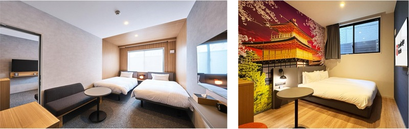

-   連住的旅客若要打掃的話，飯店打掃為3-4天一次，但每天皆會更換毛巾及清理垃圾。
-   若有需要一次性備品，飯店大廳皆有牙刷、刮鬍刀等等，都可以自取，但為響應環保能自備就自備呦！
-   飯店有準備投幣式洗烘衣機可以使用，若有需要都可以自行使用，對於長時間旅行的旅人非常便利。
-   地理位置佳：鄰近四條大宮站，要轉乘去嵐山、大阪都非常方便，而且雖然位於主要鬧區，但因為在巷弄間，晚上周邊蠻安靜，也有多家便利商店。
-   設有連通房型可以選擇，非常適合家庭旅客、一群朋友一起入住，而且以一般京都住宿來說，房間算是相對寬敞。

[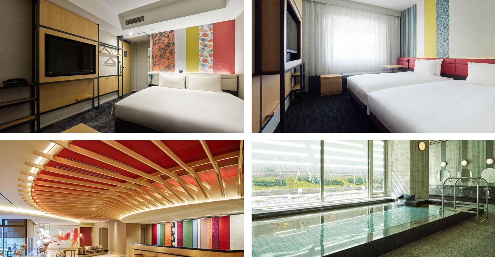](https://www.agoda.com/zh-tw/mitsui-garden-hotel-kyoto-shijo/hotel/kyoto-jp.html?cid=1895872)

### **4\. [三井花園飯店京都四條](https://www.agoda.com/zh-tw/mitsui-garden-hotel-kyoto-shijo/hotel/kyoto-jp.html?cid=1895872)**

**推薦原因 |** 飯店還附有溫泉可以泡，距離車站大概走路5-10分鐘就會抵達，飯店附近也有公車可以搭乘，去各大景點也蠻方便的，還有便利商店，整體來說CP值蠻高的，房間清潔跟舒適度都很不錯，就是房間偏小～但還是會推薦給朋友的京都飯店。

-   **飯店評分：4.1** / 5
-   **限時優惠：[Booking](https://www.booking.com/hotel/jp/mitsui-garden-kyoto-shijo.zh-tw.html?aid=7945213) | [Agoda](https://www.agoda.com/zh-tw/mitsui-garden-hotel-kyoto-shijo/hotel/kyoto-jp.html?cid=1895872)**
-   **住宿類型：**朋友、家庭
-   **周邊景點：**距離地下鐵四條站430公尺
-   **房型價格：**標準雙人房 TWD $2,300起 / 高級房 TWD $4,000起**[(更多房型)](https://www.agoda.com/zh-tw/mitsui-garden-hotel-kyoto-shijo/hotel/kyoto-jp.html?cid=1895872)**

[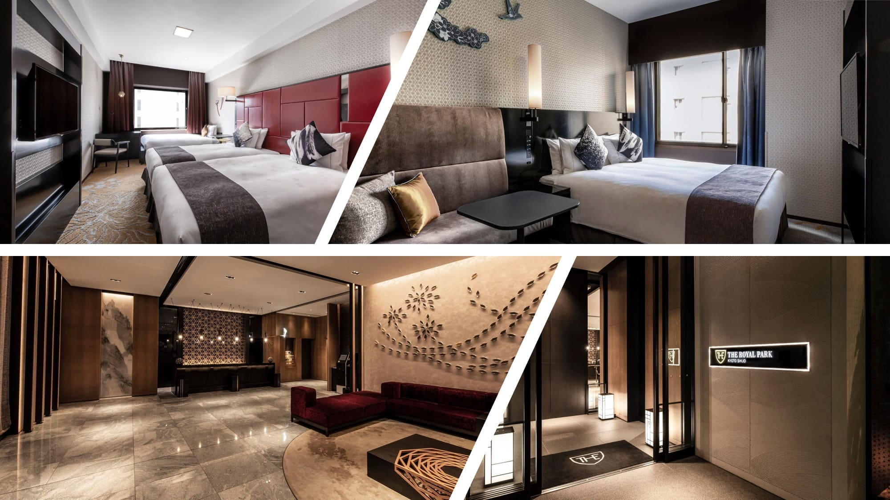](https://www.agoda.com/zh-tw/the-royal-park-hotel-kyoto-shijo/hotel/kyoto-jp.html?cid=1895872)

### **5\. [京都四條皇家花園酒店](https://www.agoda.com/zh-tw/the-royal-park-hotel-kyoto-shijo/hotel/kyoto-jp.html?cid=1895872)**

**推薦原因 |** 房間設備都很乾淨整個，感覺還蠻新的，飯店位置就在地下鐵的出口旁，交通便利，蠻鄰近花見小路、祇園等景點，找餐廳或逛街等等都很方便，附近蠻熱鬧的，房間比想像中寬敞很多，行李可以平放還有空間可以走路，算是蠻新開幕的[京都住宿](https://www.pandafishtravel.tw/hotel/archives/3025/)。

-   **飯店評分：4.4** / 5
-   **限時優惠：[Booking](https://www.booking.com/hotel/jp/the-royal-park-kyoto-shijo.zh-tw.html?aid=7945213) | [Agoda](https://www.agoda.com/zh-tw/the-royal-park-hotel-kyoto-shijo/hotel/kyoto-jp.html?cid=1895872)**
-   **住宿類型：**朋友、家庭
-   **周邊景點：**距離地下鐵四條站100公尺
-   **房型價格：**標準房(兩床) TWD $1,700起 / 套房(兩床) TWD $4,200起**[(更多房型)](https://www.agoda.com/zh-tw/the-royal-park-hotel-kyoto-shijo/hotel/kyoto-jp.html?cid=1895872)**

[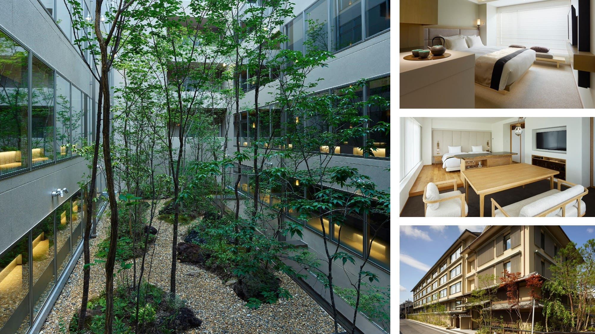](https://www.agoda.com/zh-tw/hotel-the-celestine-kyoto-gion/hotel/kyoto-jp.html?cid=1895872)

### **6\. [京都祇園賽萊斯廷酒店](https://www.agoda.com/zh-tw/hotel-the-celestine-kyoto-gion/hotel/kyoto-jp.html?cid=1895872)**

**推薦原因 |** 如果想找高級京都飯店，非常推薦京都祇園賽萊斯廷酒店，環境幽靜舒適，還有溫泉可以泡，另外飯店還有接駁車到京都車站，相當方便，另外離京都的景點都蠻近的，像是花間小路、清水寺等等，下次來京都會想再入住。

-   **飯店評分：4.5** / 5
-   **限時優惠：[Booking](https://www.booking.com/hotel/jp/the-celestine-kyoto-gion.zh-tw.html?aid=7945213) | [Agoda](https://www.agoda.com/zh-tw/hotel-the-celestine-kyoto-gion/hotel/kyoto-jp.html?cid=1895872)**
-   **住宿類型：**朋友、家庭、情侶
-   **周邊景點：**距離地下鐵四條站100公尺
-   **房型價格：**豪華雙人房 TWD $5,700起 / 小型套房 TWD $15,000起**[(更多房型)](https://www.agoda.com/zh-tw/hotel-the-celestine-kyoto-gion/hotel/kyoto-jp.html?cid=1895872)**

## 京都住宿推薦｜京都五条

### **1.[京都烏丸五條京王普雷利亞飯店](https://www.agoda.com/zh-tw/keio-prelia-hotel-kyoto-karasuma-gojo/hotel/kyoto-jp.html?cid=1895872)**

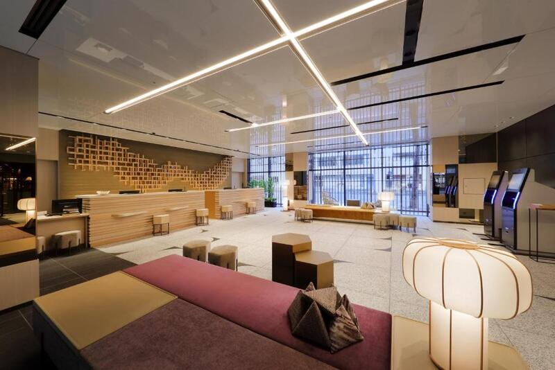

**【綜合評分】：4.4**/5

**【房型價格】：**標準雙人房 TWD $1,600起 | 家庭四人房 TWD $5,200起**[(更多房型)](https://www.agoda.com/zh-tw/keio-prelia-hotel-kyoto-karasuma-gojo/hotel/kyoto-jp.html?cid=1895872)**

**【限時優惠】：[Agoda](https://www.agoda.com/zh-tw/keio-prelia-hotel-kyoto-karasuma-gojo/hotel/kyoto-jp.html?cid=1895872) | [Booking](https://www.booking.com/hotel/jp/keio-prelia-hotel-kyoto-karasuma-gojo.zh-tw.html?aid=7945213)**

**【周邊景點】：**地下鐵五條站340公尺

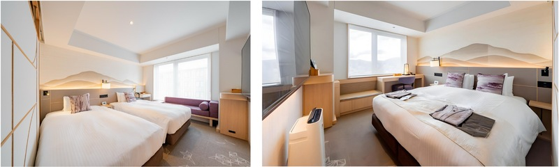

-   飯店設有大浴場可以使用，觀光玩一整天可以好好泡澡放鬆一下，針對女性浴場還有特別增加密碼，進出更加安全。
-   早餐採自助吧形式，主要為西式風格，像是義大利麵、披薩等等，蠻貼心的是咖啡還有準備外帶咖啡杯，非常貼心！
-   性價比高：相較於四條、三條區域，價格相對便宜，而且也算是在京都市中心。
-   房內的電視可以看到目前大浴場的使用人數及洗衣機使用狀況，看完再決定要不要出房間使用。
-   房間整體舒適度很不錯，在遮光度、隔音都表現非常好，而且將行李平開房在桌子下，就有空間可以走動了。

### **2.[sequence飯店-京都五条](https://www.agoda.com/zh-tw/sequence-kyoto-gojo/hotel/kyoto-jp.html?cid=1895872)**

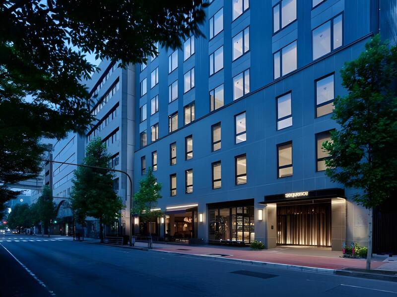

**【綜合評分】：4.1**/5

**【房型價格】：**標準雙人房 TWD $2,400起 | 基本四人房 TWD $4,600起**[(更多房型)](https://www.agoda.com/zh-tw/sequence-kyoto-gojo/hotel/kyoto-jp.html?cid=1895872)**

**【限時優惠】：[Agoda](https://www.agoda.com/zh-tw/sequence-kyoto-gojo/hotel/kyoto-jp.html?cid=1895872) | [Booking](https://www.booking.com/hotel/jp/sequence-kyoto-gojo.zh-tw.html?aid=7945213)**

**【周邊景點】：**地下鐵五條站280公尺

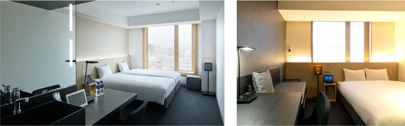

-   飯店的入住及退房時間蠻特別，下午5點入住，退房則是下午兩點，可以睡飽一些，也可以在京都停留更久時間，魚兒也覺得這個時間安排非常適合旅人。
-   早餐採半自助式，提供主餐另外沙拉、麵包及湯品都可以再自取。
-   高科技設計，蠻特別的是可以用人臉作為鑰匙進出客房及浴場設施等等，房間內還有平板可以設定鬧鐘、空調及電燈等等。
-   距離地鐵站大約步行2-3分鐘，周邊也有多家便利商店、餐廳及24小時超市等等，機能便利！
-   入住的話飯店還會提供兌換券，可以在一樓的酒吧免費兌換飲品。

### **3.[京都清水五條相鐵FRESA INN](https://www.agoda.com/zh-tw/sotetsu-fresa-inn-kyoto-kiyomizu-gojo/hotel/kyoto-jp.html?cid=1895872)**

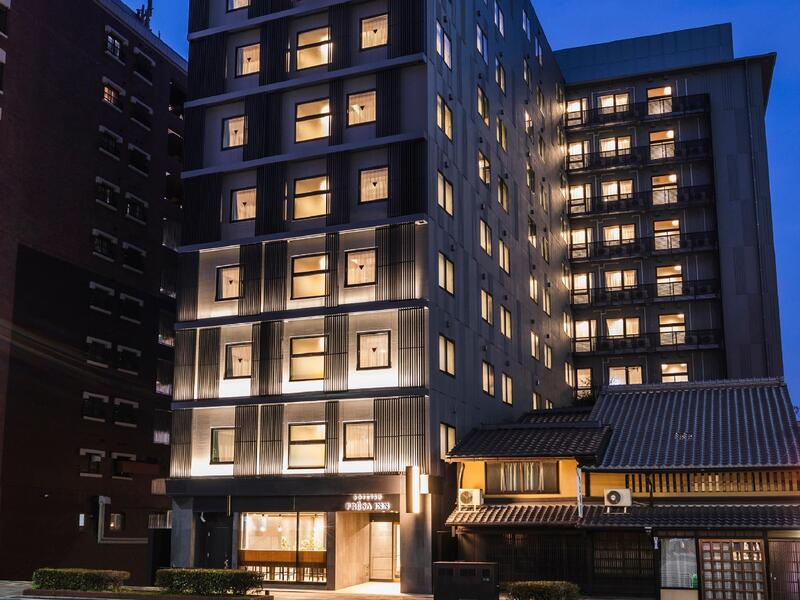

**【綜合評分】：4.5**/5

**【房型價格】：**標準雙人房 TWD $2,600起 | 連通四人房 TWD $7,400起**[(更多房型)](https://www.agoda.com/zh-tw/sotetsu-fresa-inn-kyoto-kiyomizu-gojo/hotel/kyoto-jp.html?cid=1895872)**

**【限時優惠】：[Agoda](https://www.agoda.com/zh-tw/sotetsu-fresa-inn-kyoto-kiyomizu-gojo/hotel/kyoto-jp.html?cid=1895872) | [Booking](https://www.booking.com/hotel/jp/sotetsu-fresa-inn-kyoto-kiyomizu-gojo.zh-tw.html?aid=7945213)**

**【周邊景點】：**地下鐵五條站470公尺

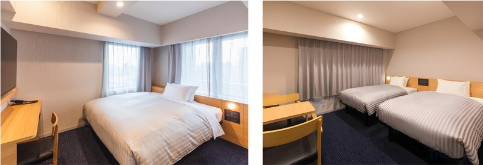

-   飯店提供的備品超級豐富，從常見的牙刷、化妝水通通都有，甚至還有面膜、髮膜或是泡澡粉，提供的備品非常多元！
-   如果女生想用直髮夾、電棒捲，也可以跟櫃台租借，不用自己帶超級方便！
-   房間電視可以連結youtube、Netflix，床墊則是提供席伊麗，睡眠品質也很不錯。
-   另外床底下也有一些空間，可以把行李箱塞到床底下，讓房間更加寬敞好走動。
-   雖然不是在京都主要的鬧區，但要前往鬧區主要景點還是非常方便，所以還是性價比非常好的[京都飯店](https://www.pandafishtravel.tw/hotel/archives/3025/)。

## 京都住宿心得總結

整個看下來很多住宿都有濃濃的日本氛圍，也開了不少新飯店，私心覺得都到了京都這個古色古香的城市，就是要選擇日式傳統風格並設有溫泉的飯店呦！私心推薦京都梅小路花傳抄，融合日式傳統，也有著現代的氛圍，京都住宿選擇非常豐富，有人考慮交通、房間，每間都各有特色，大家可以選擇讓旅程加分的[京都住宿](https://www.pandafishtravel.tw/hotel/archives/3025/)。

**京都行程推薦
**行程推薦：[京都郊區一日遊](https://www.kkday.com/zh-tw/product/13942?cid=10428) | [伏見稻荷大社&嵐山&金閣寺＆奈良公園](https://www.kkday.com/zh-tw/product/13894?cid=10428) | [嵐山小火車&保津川遊船&京馬車](https://www.kkday.com/zh-tw/product/12189?cid=10428)
景點門票：[元離宮二條城門票](https://www.kkday.com/zh-tw/product/22294?cid=10428) | [風風之湯入場門票](https://www.kkday.com/zh-tw/product/21596?cid=10428) | [京都塔展望台 Kyoto Tower 入場券](https://www.kkday.com/zh-tw/product/21147-kyoto-tower-observation-deck-ticket-japan?cid=10428)
京都體驗：[四季櫻花和服體驗](https://www.kkday.com/zh-tw/product/1853?cid=10428) | [櫻京和服日式租借體驗](https://www.kkday.com/zh-tw/product/10827?cid=10428)| [嵐山人力車體驗](https://www.kkday.com/zh-tw/product/1945?cid=10428)
大眾交通：[日本關西機場快線 HARUKA車票](https://www.kkday.com/zh-tw/product/18940?cid=10428) | [利木津巴士車票](https://www.kkday.com/zh-tw/product/4835?cid=10428) | [日本 JR PASS](https://www.kkday.com/zh-tw/product/20291-japan-rail-pass?cid=10428)
日本網路：[日本 WIFI 分享器租借](https://www.kkday.com/zh-tw/product/114034?cid=10428) | [日本 4G 網卡](https://www.kkday.com/zh-tw/product/19807?cid=10428) | [SoftBank 上網吃到飽](https://www.kkday.com/zh-tw/product/10691?cid=10428)

## 京都住宿評價

**飯店名稱**

**價格**

**評價**

**預訂**

**[京都千飯店](https://www.agoda.com/zh-tw/the-thousand-kyoto/hotel/kyoto-jp.html?cid=1895872)**

TWD 4,300起

4.4 / 5

**[查看房間](https://www.agoda.com/zh-tw/the-thousand-kyoto/hotel/kyoto-jp.html?cid=1895872)**

**[京都M’s酒店](https://www.agoda.com/zh-hk/hotel-the-m-s-kyoto/hotel/kyoto-jp.html?cid=1895872)**

TWD 1,200起

4.4 / 5

**[查看房間](https://www.agoda.com/zh-hk/hotel-the-m-s-kyoto/hotel/kyoto-jp.html?cid=1895872)**

**[三井花園酒店京都三條尊貴](https://www.agoda.com/zh-tw/kyoto-sanjo-hotel-tentative-name/hotel/kyoto-jp.html?cid=1895872)**

TWD 5,800起

4.3 / 5

**[查看房間](https://www.agoda.com/zh-tw/kyoto-sanjo-hotel-tentative-name/hotel/kyoto-jp.html?cid=1895872)**

[DoubleTree by Hilton Kyoto Higashiyama](https://www.agoda.com/zh-tw/hotel-senren-kyoto-higashiyama-kiyomizu-h21760763/hotel/kyoto-jp.html?cid=1895872)

TWD 4,300起

4.3 / 5

**[查看房間](https://www.agoda.com/zh-tw/hotel-senren-kyoto-higashiyama-kiyomizu-h21760763/hotel/kyoto-jp.html?cid=1895872)**

**[京都格蘭比亞大酒店](https://www.agoda.com/zh-tw/hotel-granvia-kyoto/hotel/kyoto-jp.html?cid=1895872)**

TWD 3,400起

4.3 / 5

**[查看房間](https://www.agoda.com/zh-tw/hotel-granvia-kyoto/hotel/kyoto-jp.html?cid=1895872)**

**[京都四條大宮旅客之家飯店](https://www.agoda.com/zh-tw/travelodge-kyoto-shijo-omiya/hotel/kyoto-jp.html?cid=1895872)**

TWD 1,000起

4.5 / 5

**[查看房間](https://www.agoda.com/zh-tw/travelodge-kyoto-shijo-omiya/hotel/kyoto-jp.html?cid=1895872)**

**[櫻花台畫廊飯店](https://www.agoda.com/zh-tw/sakura-terrace-the-gallery/hotel/kyoto-jp.html?cid=1895872)**

TWD 2,300起

4.4 / 5

**[查看房間](https://www.agoda.com/zh-tw/sakura-terrace-the-gallery/hotel/kyoto-jp.html?cid=1895872)**

**[三井花園飯店京都四條](https://www.agoda.com/zh-tw/mitsui-garden-hotel-kyoto-shijo/hotel/kyoto-jp.html?cid=1895872)**

TWD 2,300起

4.1 / 5

**[查看房間](https://www.agoda.com/zh-tw/mitsui-garden-hotel-kyoto-shijo/hotel/kyoto-jp.html?cid=1895872)**

**[京阪京都站南飯店](https://www.agoda.com/zh-tw/hotel-keihan-kyotoeki-minami/hotel/hatasho-cho-jp.html?cid=1895872)**

TWD 2,000起

4.4 / 5

**[查看房間](https://www.agoda.com/zh-tw/hotel-keihan-kyotoeki-minami/hotel/hatasho-cho-jp.html?cid=1895872)**

**[M’s Plus 四條大宮酒店](https://www.agoda.com/zh-hk/hotel-m-s-plus-shijo-omiya/hotel/kyoto-jp.html?cid=1895872)**

TWD 890起

4.2 / 5

**[查看房間](https://www.agoda.com/zh-hk/hotel-m-s-plus-shijo-omiya/hotel/kyoto-jp.html?cid=1895872)**

**[sequence飯店-京都五条](https://www.agoda.com/zh-tw/sequence-kyoto-gojo/hotel/kyoto-jp.html?cid=1895872)**

TWD 2,400起

4.1 / 5

**[查看房間](https://www.agoda.com/zh-tw/sequence-kyoto-gojo/hotel/kyoto-jp.html?cid=1895872)**

**[京都祇園賽萊斯廷酒店](https://www.agoda.com/zh-tw/hotel-the-celestine-kyoto-gion/hotel/kyoto-jp.html?cid=1895872)**

TWD 5,700起

4.5 / 5

**[查看房間](https://www.agoda.com/zh-tw/hotel-the-celestine-kyoto-gion/hotel/kyoto-jp.html?cid=1895872)**

**[京都十字飯店 (Cross Hotel Kyoto)](https://www.agoda.com/zh-tw/cross-hotel-kyoto/hotel/kyoto-jp.html?cid=1895872)**

TWD 2,700起

4.6 / 5

**[查看房間](https://www.agoda.com/zh-tw/cross-hotel-kyoto/hotel/kyoto-jp.html?cid=1895872)**

**[京都河原町三條Resol飯店](https://www.agoda.com/zh-tw/hotel-resol-kyoto-kawaramachi-sanjo_2/hotel/kyoto-jp.html?cid=1895872)**

TWD 1,700起

4.5 / 5

**[查看房間](https://www.agoda.com/zh-tw/hotel-resol-kyoto-kawaramachi-sanjo_2/hotel/kyoto-jp.html?cid=1895872)**

**[索拉利亞西鐵飯店-京都Premier](https://www.agoda.com/zh-tw/solaria-nishitetsu-hotel-kyoto-premier/hotel/kyoto-jp.html?cid=1895872)**

TWD 3,900起

4.4 / 5

**[查看房間](https://www.agoda.com/zh-tw/solaria-nishitetsu-hotel-kyoto-premier/hotel/kyoto-jp.html?cid=1895872)**

**[京都烏丸五條京王普雷利亞飯店](https://www.agoda.com/zh-tw/keio-prelia-hotel-kyoto-karasuma-gojo/hotel/kyoto-jp.html?cid=1895872)**

TWD 1,600起

4.4 / 5

**[查看房間](https://www.agoda.com/zh-tw/keio-prelia-hotel-kyoto-karasuma-gojo/hotel/kyoto-jp.html?cid=1895872)**

**[京都清水五條相鐵FRESA INN](https://www.agoda.com/zh-tw/sotetsu-fresa-inn-kyoto-kiyomizu-gojo/hotel/kyoto-jp.html?cid=1895872)**

TWD 2,600起

4.5 / 5

**[查看房間](https://www.agoda.com/zh-tw/sotetsu-fresa-inn-kyoto-kiyomizu-gojo/hotel/kyoto-jp.html?cid=1895872)**

**[M’s INN 東山賓館](https://www.agoda.com/zh-tw/m-s-inn-higashiyama/hotel/kyoto-jp.html?cid=1895872)**

TWD 760起

4.5 / 5

**[查看房間](https://www.agoda.com/zh-tw/m-s-inn-higashiyama/hotel/kyoto-jp.html?cid=1895872)**

**[京都梅小路花傳抄](https://www.agoda.com/zh-tw/kyoto-umekoij-kadensho/hotel/kyoto-jp.html?cid=1895872)**

TWD 6,600起

4.3 / 5

**[查看房間](https://www.agoda.com/zh-tw/kyoto-umekoij-kadensho/hotel/kyoto-jp.html?cid=1895872)**

**[京都花宿 (Kyoto Hana Hostel)](https://www.agoda.com/zh-tw/kyoto-hana-hostel/hotel/kyoto-jp.html?cid=1895872)**

TWD 990起

4.4 / 5

**[查看房間](https://www.agoda.com/zh-tw/kyoto-hana-hostel/hotel/kyoto-jp.html?cid=1895872)**

## 京都住宿常見問題 Q&A

**Q1：可以泡溫泉的京都住宿推薦？**

A1：**[京都梅小路花傳抄](https://www.agoda.com/zh-tw/kyoto-umekoij-kadensho/hotel/kyoto-jp.html?cid=1895872)、[三井花園飯店京都四條](https://www.agoda.com/zh-tw/mitsui-garden-hotel-kyoto-shijo/hotel/kyoto-jp.html?cid=1895872)****，**都是非常可以泡溫泉甚至還有私人溫泉可以設京都住宿。

**Q2：性價比高的京都飯店推薦？**

A2： [京都烏丸五條京王普雷利亞飯店](https://www.agoda.com/zh-tw/keio-prelia-hotel-kyoto-karasuma-gojo/hotel/kyoto-jp.html?cid=1895872)**、[京都十字飯店](https://www.agoda.com/zh-tw/kyoto-hana-hostel/hotel/kyoto-jp.html?cid=1895872)**都是CP值高的[京都飯店推薦](https://www.pandafishtravel.tw/hotel/archives/3025/)。

**Q2：京都飯店有推薦要住哪一區嗎？**

A2：大部分都是主要四個區域，像是京都車站周邊、三條通、四條通及五條通周邊的[京都住宿](https://www.pandafishtravel.tw/hotel/archives/3025/)，都有非常多的選擇。

**Q3：京都有哪些必去的景點**

A3：花見小路、清水寺及祇園、伏見稻荷大社，絕對是京都最熱門的幾個景點～

**Q5：適合親子家庭的京都住宿？**

A5：[像是三井花園酒店京都三條尊貴](https://www.agoda.com/zh-tw/kyoto-sanjo-hotel-tentative-name/hotel/kyoto-jp.html?cid=1895872)、[京都格蘭比亞大酒店](https://www.agoda.com/zh-tw/hotel-granvia-kyoto/hotel/kyoto-jp.html?cid=1895872)都是非常適合親子家庭的住宿。

**大阪周邊住宿**

[大阪必住》2026大阪住宿推薦：30間人氣大阪飯店名單大解析！近心齋橋、難波、梅田](https://pandafishtravel.tw/hotel/archives/2874/)

[【2026心齋橋飯店】大阪血拚必看，TOP12位置極好的心齋橋住宿！](https://pandafishtravel.tw/hotel/archives/5439/)

[【2026奈良住宿】TOP 12奈良飯店民宿，高CP值奈良親子住宿推薦！](https://www.pandafishtravel.tw/hotel/archives/4267/)

[精選【2026難波住宿推薦】8間步行就到心齋橋道頓崛，性價比超高！](https://pandafishtravel.tw/hotel/archives/5719/)

[TOP 12【2026梅田住宿】人氣民宿飯店推薦！購物、交通超便利！](https://pandafishtravel.tw/hotel/archives/5821/)

**更多日本旅遊**

[【2026京都必買攻略】7大熱門伴手禮推薦，嚐盡古都的風味！](https://pandafishtravel.tw/world_travel/archives/5320/)

[【2026日本必買】TOP20必買藥妝保養品、電器、私房伴手禮推薦總整理！](https://www.pandafishtravel.tw/world_travel/archives/3964/)

[【日本自由行】2023最新日本入境政策，航空旅遊平台優惠總整理](https://www.pandafishtravel.tw/world_travel/archives/3001/)

[Facebook](https://www.facebook.com/sharer/sharer.php?u=https://pandafishtravel.tw/hotel/archives/3025/)[Telegram](https://telegram.me/share/url?url=https%3A%2F%2Fpandafishtravel.tw%2Fhotel%2Farchives%2F3025%2F&text=%E3%80%902026%E4%BA%AC%E9%83%BD%E9%A3%AF%E5%BA%97%E5%BF%83%E5%BE%97%E3%80%91%E7%B2%BE%E9%81%B820%E9%96%93%E9%AB%98CP%E5%80%BC%E4%BA%AC%E9%83%BD%E4%BD%8F%E5%AE%BF%E6%8E%A8%E8%96%A6%EF%BC%8C%E8%BF%91%E5%B8%82%E4%B8%AD%E5%BF%83%EF%BC%81)[LINE](https://social-plugins.line.me/lineit/share?url=https://pandafishtravel.tw/hotel/archives/3025/)

previous post

[

##### 【2026嘉義飯店】嘉義住宿推薦精選15間，高CP值熱門！

](https://pandafishtravel.tw/hotel/archives/2797/)

next post

[

##### 【2026逢甲住宿推薦】高回訪率！精選13間鄰近逢甲夜市飯店民宿總整理

](https://pandafishtravel.tw/hotel/archives/4453/)